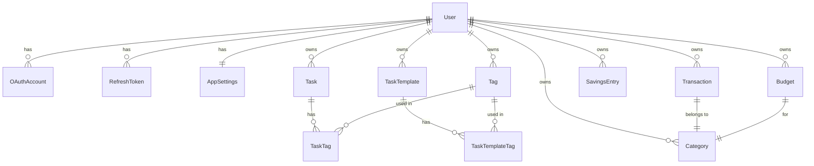

# ARCHITECTURE.md — MyDay

Справочник по архитектурным решениям, связям в БД и зонам риска. Правила работы и повседневные конвенции — в `CLAUDE.md`. Открывай этот файл при работе с БД, security-логикой или перед рефакторингом, задевающим что-то из списка ниже.

---

## Архитектура БД

### Ключевые решения

| Решение | Почему |
|---------|--------|
| Hard delete везде | Проект личный, нет нужды в восстановлении удалённых данных |
| `Decimal(12,2)` для денег | Float накапливает ошибки (`0.1 + 0.2 ≠ 0.3`) при агрегации |
| `date` + `createdAt` в Transaction | `date` — когда произошла транзакция (user sets), `createdAt` — когда создана запись. Фильтрация по месяцу всегда по `date` |
| Категории per-user, сидируются при регистрации | Нет nullable userId, каждый владеет своими категориями, может удалять любые |
| Tags — отдельная таблица many-to-many | Тег — сущность: можно переименовать, добавить цвет, считать статистику. `Tag.color` nullable — до появления UI цвета старые теги не ломаются |
| `SavingsEntry` отдельно от `Transaction` | Накопительный счёт не пересекается с основными финансами. Отдельная таблица = чистые запросы. `SavingsEntry` имеет `type: SavingsType (DEPOSIT \| WITHDRAWAL)` и всегда положительный `amount`. Баланс = `SUM(DEPOSIT) - SUM(WITHDRAWAL)`. Это позволяет и пополнять, и снимать с накоплений |
| Баланс накоплений — всегда total, не по месяцу | Накопления накопительные по природе: если отложил 10к в январе и 5к в феврале — итого 15к, а не 5к. Фильтр по месяцу применяется только к истории записей, не к балансу. `GET /api/finance/savings` возвращает `{ balance, entries }` где `balance` = SUM за всё время |
| `RefreshToken` в БД с bcrypt-хешем | Инвалидация токенов при logout/смене пароля. Хеш — если БД утечёт, сырые токены не скомпрометированы |
| `shared/` для типов и Zod | Единственный способ шарить код между client и server в Nuxt без хаков |
| Агрегация finance на сервере | SQL SUM/GROUP BY быстрее чем JS reduce на 500 записях |
| PIN — UI lock, не второй фактор | Пользователь аутентифицирован, PIN только блокирует интерфейс. Хеш в `AppSettings`, валидация на клиенте без сетевого запроса. Сброс — через провайдера регистрации (Google re-auth или пароль аккаунта). Осознанный компромисс: хеш 4-значного PIN на клиенте брутится оффлайн — допустимо только потому что PIN не граница безопасности |
| `SavingsEntry` без поля `date` | Копилке важно движение средств, а не точная дата события — бэкдейт не поддерживаем (осознанно). История сортируется по `createdAt`. Следствие (2.23): период истории и delta считаются по `createdAt` — это настоящий timestamp, а не `@db.Date`, поэтому границы берутся по UTC: `createdAt >= from 00:00Z` и `< to + 1 день 00:00Z`. У пользователя в UTC+3 запись, созданная в 01:00 первого числа, попадёт в предыдущий месяц. Мириться с этим дешевле, чем заводить у копилки собственную календарную дату ради нескольких пограничных часов |
| Таймзоны: сервер TZ-agnostic | «Сегодня» и границы месяца определяет клиент в своей таймзоне и передаёт `from`/`to` в query. Сервер не делает дата-математику от собственного `new Date()` — у москвича и нью-йоркца «сегодня» разное |
| Календарная дата на проводе — всегда `YYYY-MM-DD` (решение 10.09.2026, распространено на `Task.dueDate` 14.09.2026) | `Transaction.date`, `Budget.month` и `Task.dueDate` — `@db.Date`, то есть календарный день без времени. Поэтому и в query (`from`/`to`), и в body (`date`) ходит date-only строка, посчитанная клиентом в его таймзоне (`toDateString()` в `app/utils/formatDate.ts`). Полный ISO datetime отвергается схемой с 400. Почему: `new Date().toISOString()` отдаёт UTC-мгновение, и Postgres обрезал его до UTC-дня — в UTC−7 любая вечерняя транзакция уезжала на следующий день, а 31-го числа — в следующий месяц. Обратная сторона того же правила: date-only значение нельзя читать через локальные геттеры `new Date(...)` — форматтеры в `app/utils/formatDate.ts` разбирают такую строку как календарную дату, группировка по дням берёт ключ через `toDayKey` (срез строки, а не локальные геттеры) |
| Удаление категории → переназначение на «Другое» (решение 28.07.2026) | Каждому пользователю сидируются две системные категории «Другое» (EXPENSE и INCOME) с флагом `isSystem` — их нельзя удалить и сменить тип. При удалении обычной категории её транзакции переназначаются на «Другое» того же типа, бюджеты категории удаляются — всё в одной `$transaction`. История и итоги прошлых месяцев не меняются. Альтернатива (каскад) отвергнута: удаление категории — операция над таксономией, а не над финансовой историей. Реализовано в **4.5.0** |
| Тип транзакции и тип категории обязаны совпадать (решение 11.09.2026) | `Transaction.type` и `Category.type` — независимые поля, FK их не связывает, и EXPENSE под «Salary» молча искажал бы breakdown и итоги. Проверяется в хендлере (400): POST сверяет пару, PATCH — *итоговую* пару после применения патча, поэтому сменить тип транзакции можно только вместе с категорией. В UI это уже так: сетка категорий фильтруется по типу (DESIGN.md → TransactionEditSheet) |
| Summary и список транзакций делят один фильтр-контракт (решение 11.09.2026) | `GET /api/finance/summary` принимает те же `from`/`to`/`type`/`categoryIds`/`search`, что и `GET /api/finance/transactions`: схема `transactionFilterQuerySchema` (список = она же плюс `page`/`limit`) и один построитель WHERE — `server/utils/transactionWhere.ts`. Иначе hero и breakdown считались бы по одному набору, а список под ними — по другому. `breakdown` остаётся разбивкой **расходов** («Spend by category» в дизайне): при `type=INCOME` он пустой, а не превращается в разбивку доходов. Тот же эндпоинт закрывает `ResultSummary` в All Transactions (2.21) |
| Ответ 404 на чужой или отсутствующий ресурс (решение 11.09.2026) | Одиночные `PATCH`/`DELETE` ограничены `where: { id, userId }`, поэтому чужая запись и несуществующая неотличимы — обе дают Prisma P2025, и обе должны отдавать 404, а не 500 и не 403: по коду ответа нельзя узнать, существует ли чужой id. Маппинг — `orNotFound`/`orConflict` в `server/utils/dbError.ts`, один идиом на все ресурсы |
| Названия сидовых категорий локализуются через `key`, а не переводом строк в БД (решение 11.09.2026) | Категории — данные пользователя (их переименовывают), поэтому в БД лежит `name`, и сидовые приходили только на английском. Решение: у сидовых категорий будет `Category.key` (`food`, `transport`, …), и UI показывает `t('categories.<key>')`; как только пользователь меняет `name`, `key` обнуляется и дальше показывается его текст. Так переключение языка переводит нетронутые категории, а свои и переименованные остаются как есть. Отвергнуто: сеять на языке регистрации (существующие строки и смена языка не чинятся) и хранить пару `nameEn`/`nameRu` (не работает для пользовательских категорий). Реализовано в **4.5.0** одной миграцией с `isSystem` |
| Budgets и Notifications — отложены до v2 (решение 28.07.2026) | MVP = Tasks + Finance (транзакции, периоды, фильтры, savings). Дата-слой бюджетов (модель, API, хуки) уже существует — не удалять и не ломать; таб Budgets скрыт из UiPillSelect. План v2 — Фаза 7 (см. `ROADMAP.md`) |

### Диаграмма связей



### Auth Flow

```mermaid
sequenceDiagram
    participant C as Client
    participant S as Server
    participant DB as Database
    participant G as Google

    Note over C,G: Email/Password регистрация
    C->>S: POST /api/auth/register {name, email, password}
    S->>S: Zod validation
    S->>DB: Create User + AppSettings + seed Categories
    S->>DB: Create RefreshToken (hashed)
    S-->>C: {accessToken} + Set-Cookie: refreshToken (httpOnly)

    Note over C,G: Google OAuth
    C->>S: GET /api/auth/oauth/google
    S-->>C: redirect → Google consent
    C->>G: user consents
    G-->>S: GET /callback?code=xxx
    S->>G: exchange code → tokens + profile
    S->>DB: Upsert User + OAuthAccount
    S-->>C: {accessToken} + Set-Cookie: refreshToken

    Note over C,S: Защищённый запрос
    C->>S: GET /api/tasks + Authorization: Bearer <accessToken>
    S->>S: middleware/01.auth.ts verifies JWT
    S-->>C: tasks data

    Note over C,S: Token refresh (автоматически при 401)
    C->>S: POST /api/auth/refresh (cookie отправляется браузером)
    S->>DB: find RefreshToken by hash, check expiresAt
    S->>DB: rotate — delete old, create new
    S-->>C: {accessToken} + новый refreshToken cookie

    Note over C,S: Logout
    C->>S: POST /api/auth/logout
    S->>DB: delete RefreshToken
    S-->>C: Set-Cookie: refreshToken=; Max-Age=0
```

### Зоны риска — нельзя менять без рефакторинга

| Решение | Что сломается при изменении |
|---------|----------------------------|
| `Decimal` для `amount` | Все агрегации, сравнения, отображение |
| `date` поле в Transaction | Вся фильтрация по месяцу/периоду |
| `userId` в каждом WHERE | Утечка данных между пользователями (security) |
| `shared/` для типов и схем | Дублирование валидации или импорт-хаки |
| httpOnly cookie для refreshToken | XSS-уязвимость если переехать в localStorage |
| Per-user категории (сид при регистрации) | Data migration + изменение всех запросов |
| `SavingsEntry` отдельно от `Transaction` | Data migration если объединить |
| Нумерация middleware (`01.auth.ts`) | Порядок выполнения в Nitro |
| Хук `close` в `nuxt.config.ts` | `nuxt build` перестанет завершаться — см. «Известные баги» |
| `clearApiCache()` в `authStore.logout()` | Ответы API прошлого пользователя останутся в кэше service worker и достанутся следующему — см. ниже |
| `pages/settings/index.vue`, а не `pages/settings.vue` | Файл-страница рядом с одноимённой папкой становится вложенным роут-родителем: без `<NuxtPage />` внутри дочерние страницы не рендерятся, а URL при этом меняется |
| Уникальный индекс `[userId, name, type]` у `Category` | Вернёшь `[userId, name]` — вторая системная «Другое» (INCOME) перестанет ложиться при регистрации |
| Ранний выход и дедупликация в `authStore.init()` | `/api/auth/refresh` ротирует токен — повторный вызов ротирует ещё раз, параллельный упадёт на удалённой строке |
| `await authStore.init()` внутри `middleware/auth.ts` | Мидлвар идёт раньше `app.vue`; без ожидания жёсткая перезагрузка защищённой страницы выкидывает на `/auth/welcome` с валидной кукой |
| Порядок `:root[data-accent]` → `.light[data-accent]` в `main.css` | Селекторы равны по специфичности; поменяешь местами — светлая тема потеряет выбранный акцент |
| `themeSurfaces` в `useTheme.ts` | Дублирует `--c-bg` обеих тем для мета-тега `theme-color` — правится вместе с CSS |
| Полоса-подложка `top-full` под `UiSheet` | `ease-spring` перелетает конечную точку; уберёшь — при открытии под шитом мигает дыра до низа экрана |
| `@click.capture` в `UiSwipeRow` | Браузер шлёт `click` после свайпа; уберёшь — свайп по строке снова будет открывать шит редактирования |

### Кэш service worker и приватность данных

`NetworkFirst` на `/api/*` (шаг 4.2) даёт офлайн-доступ к задачам и финансам, но Workbox формирует ключ кэша **по URL и игнорирует заголовок `Authorization`**. Для `/api/tasks` это значит, что ответ, сложенный под одним аккаунтом, будет отдан любому следующему пользователю того же браузера. Отсюда три ограничения, которые нельзя снимать по отдельности:

- `/api/auth/*` исключены из кэширования полностью — логин, refresh и logout всегда идут в сеть;
- кэшируются только GET и только ответы со статусом 200, чтобы не залипал 401;
- `authStore.logout()` вызывает `clearApiCache()` — это единственное, что реально разрывает связь между аккаунтами на общем устройстве.

Срок жизни записей — сутки, так что данные не переживают смену пользователя надолго даже без явного выхода. Если появится переключение аккаунтов без `logout()`, чистку кэша нужно повесить и на него.

### Оптимистичные апдейты в TanStack Query

Оптимистику получают только **удаление и переключение** (`useToggleTaskMutation`, `useDeleteTaskMutation`, `useDeleteTransactionMutation`, `useDeleteSavingsMutation`). Создание и редактирование живут на `invalidateQueries` в `onSuccess`, и это осознанно: сервер владеет полями, которые клиент не может вывести (`id`, `createdAt`, позиция в сортировке и пагинации, JOIN-нутые категории и теги), поэтому оптимистичная вставка показала бы строку, отличающуюся от той, что придёт с сервера.

Общий каркас — `app/utils/optimistic.ts`: `snapshotQueries` (cancel + снимок), `restoreQueries` (откат в `onError`), `invalidateWhenSettled`. Чистые функции пересчёта кэшей финансов — `app/utils/financeCache.ts`, они же покрыты юнит-тестами отдельно от хуков.

Три неочевидных момента:

- **Два кэша транзакций под одним префиксом.** `useTransactionQuery` кладёт `TransactionListResponse`, `useTransactionPagesQuery` — `InfiniteData<TransactionListResponse>`, и оба матчатся на `['transactions']`. Любой патч обязан различать формы по наличию `pages`, иначе один из экранов получит мусор.
- **`summary` правится по scope, а не по всему префиксу.** Ключи `['transactions', scope]`, `['transactions', 'pages', scope]` и `['summary', scope]` делят один `scope = { period, filters }`. Патчим только те `summary`, в чьём списке транзакция реально лежала, и дедуплицируем scope — иначе транзакция, попавшая и в плоский, и в постраничный кэш, вычтется из суммы дважды.
- **`invalidateWhenSettled` пропускает инвалидацию, пока `isMutating() > 1`.** В `onSettled` текущая мутация ещё числится `pending` (в `@tanstack/query-core` диспатч `success` идёт после колбэков), поэтому `> 1` означает «есть кто-то ещё». Без этой проверки рефетч от первого удаления возвращает строку, которую второе уже убрало оптимистично, и она мигает обратно в списке.

### Категории: системная «Другое», ключи и уникальность имени

Миграция `20260915134550_categories_system_and_keys` добавила `Category.isSystem` и `Category.key` и **сменила уникальный индекс** с `[userId, name]` на `[userId, name, type]`. Это не косметика, а необходимость: системных «Другое» две — под расходы и под доходы, — и под старым индексом вторая просто не легла бы. Побочно это разрешает то, чего пользователю раньше не хватало: «Подарки» могут существовать и как расход, и как доход.

Бэкфилл живёт в той же миграции: сидовые строки опознаются по английскому `name` + `type` и получают `key`, затем каждому пользователю досоздаётся недостающая `other-income`. У досозданных строк `id` — `gen_random_uuid()`, а не cuid: Postgres cuid не умеет, а колонка строковая и id непрозрачен. Побочный эффект бэкфилла: если пользователь сам завёл категорию с англоязычным сидовым именем, она тоже получит `key` и станет переводиться — на реальных данных это скорее то, чего он и хотел.

`categoryLabel(category, t)` — единственная точка, где решается, что показать. При заполненном `key` берётся `t('categories.<key>')`, **но если перевода нет, возвращается `name`**: иначе пользователь увидел бы в списке сырой `categories.food`. Переименование через `PATCH` обнуляет `key` — своё имя всегда побеждает; смена цвета или иконки ключ не трогает.

В UI имя в `CategoryEditSheet` открывается **локализованным** (`categoryLabel`), и если пользователь его не менял, на сервер уходит исходный `name` из БД. Иначе простое открытие шита у «Еда и напитки» отправило бы русскую строку как новое имя, обнулило `key` — и категория навсегда перестала бы переводиться.

`DELETE /api/categories/[id]` на системной категории отвечает 400. На обычной — в одной `$transaction` переносит транзакции на «Другое» того же типа, удаляет бюджеты категории и саму категорию. Если «Другое» почему-то нет, хендлер отвечает 409 и **ничего не удаляет**: молча осиротить транзакции хуже, чем отказать.

### Восстановление сессии и защита маршрутов

`POST /api/auth/refresh` **ротирует** refresh-токен: удаляет старую строку и ставит новую куку. Поэтому `authStore.init()` обязан выполняться ровно один раз за загрузку, иначе второй вызов ротирует токен повторно, а при гонке двух вызовов второй упадёт — строка уже удалена. Отсюда два ограничения в сторе: `init()` выходит сразу, если `accessToken` уже есть, и параллельные вызовы делят один промис `restore()`.

Это важно, потому что точек входа две: `app.vue` вызывает `init()` при монтировании, а `middleware/auth.ts` — до него, во время резолва маршрута. Мидлвар не может просто прочитать `isAuthenticated`: он выполняется **раньше**, чем `app.vue` успевает восстановить сессию, и на жёсткой перезагрузке защищённой страницы выкидывал бы на `/auth/welcome` даже с валидной кукой. Поэтому он сам дожидается `init()` и только потом решает.

`accessToken` живёт только в памяти и нигде не персистится — на старте он всегда `null`, так что «протухшего токена из прошлой сессии» в `init()` не бывает.

### Тема и акцент

Тему держит **`@nuxtjs/color-mode`**, который приезжает вместе с `@nuxt/ui` и уже настроен им на `classSuffix: ''` — то есть сам ставит на `<html>` класс `light` или `dark`. Свой механизм переключения не нужен: `useTheme()` — обёртка над `useColorMode()`, а не замена. Она отдаёт `preference` (`light | dark | system`), `resolved` (что реально применилось) и чинит неизвестное значение в `system`, чтобы мусор в localStorage не ронял приложение.

`colorMode.preference` в `nuxt.config.ts` выставлен в `dark`, а не в дефолтный `system` — приложение dark-first, и `AppSettings.theme` в БД тоже `@default("dark")`. Без этой строки новый пользователь со светлой ОС получал бы светлую тему вопреки обоим дефолтам.

Акцент — единственное собственное состояние: `useUiStore().accent` хранит **имя** (`violet | teal | …`), не hex. Причина в том, что у каждого акцента два значения — на тёмной теме светлое, на светлой затемнённое под контраст WCAG, — и hex не сказал бы, какое из них выбрано. `AppSettings.accent` при этом исторически хранит hex (`@default("#A78BFA")`), поэтому `toAccentName()` понимает оба формата: миграция не нужна, старые строки читаются как имя.

Как это доезжает до CSS:

- `app.vue` вешает `data-accent` на `<html>` через `useHead`, а CSS-правила вида `:root[data-accent="teal"]` и `.light[data-accent="teal"]` переопределяют `--c-accent`. Специфичность обоих селекторов одинаковая (0,2,0), поэтому **светлые правила обязаны идти в файле ниже тёмных** — иначе светлая тема потеряет акцент;
- `violet` намеренно не имеет своего `[data-accent]`-правила: это базовое значение в `:root` и `.light`, и возврат к нему работает просто отсутствием совпадения;
- `app/plugins/theme.client.ts` восстанавливает акцент из localStorage до монтирования и пишет изменения обратно. Синхронизация с `AppSettings` — отдельно, в 4.7.

`themeSurfaces` в `useTheme.ts` дублирует `--c-bg` обеих тем в TS — это нужно для мета-тега `theme-color`, значение которого нельзя взять из CSS. **Меняешь `--c-bg` — меняй и там.**

### Синхронизация настроек с сервером

`PATCH /api/settings` принимает частичное обновление `theme` / `accent` / `lang` и возвращает уже сохранённые настройки. Схема отвергает пустое тело, чтобы no-op не доходил до БД, и принимает **только имена акцентов** — hex не пройдёт валидацию. Старые строки с hex при этом продолжают читаться: `toAccentName()` понимает оба формата, и колонка переезжает на имена сама при первом изменении. Миграция не нужна.

Два уровня хранения и порядок их применения:

1. **Локально** — `localStorage` (акцент) и куки (`nuxt-color-mode`, `i18n_locale`). Применяются до монтирования, поэтому выбор не мигает при перезагрузке.
2. **Сервер** — `AppSettings`. Приезжает вместе с профилем и **перекрывает локальное**, потому что это единственный источник, общий между устройствами.

Применением занимается `app/plugins/settings.client.ts`: он читает акцент из localStorage сразу, а затем следит за `authStore.user?.settings` и накатывает серверные значения. Watcher, а не разовый вызов в `app.vue`, — потому что профиль появляется в двух случаях: при восстановлении сессии и при логине, и после логина чужие настройки тоже должны примениться.

**Записывает только страница настроек, явными вызовами** `saveSettings({ ... })` рядом с локальным применением. Сделать это watcher'ом было бы короче, но watcher сработал бы и на применении серверных значений — то есть каждый вход слал бы PATCH обратно тем же, что только что прочитал.

**Откат при ошибке сохранения намеренно не делается.** Локальное применение всегда успешно, и вернуть тему обратно под пальцем пользователя из-за сетевого сбоя хуже, чем показать тост: выбор остаётся в силе и переживает перезагрузку на этом устройстве, а до сервера доедет при следующем изменении.

### Анимации и жесты

Три вещи здесь неочевидны настолько, что без записи их снесут при первом же рефакторинге.

**`prefers-reduced-motion` гасится через `!important` на `transition-duration`, а не переопределением токенов.** Напрашивается переопределить `--duration-*` внутри медиа-запроса — все переходы читают токены, значит все и укоротятся. Не работает: Tailwind v4 **инлайнит** значение в правило (`.duration-fast { transition-duration: 150ms }`), а не подставляет `var(--duration-fast)`, поэтому на утилиты переопределение переменной не действует вообще. Замерено в браузере: при `reducedMotion: reduce` переход, заданный через `var(--duration-swipe)`, укорачивается, а заданный классом `duration-fast` — нет. Отсюда бланкетное правило на `*`.

**Слой действия в `UiSwipeRow` живёт до `transitionend`, а не до сброса `offset`.** Иначе цветная подложка исчезает в тот же кадр, в котором строка начинает пружинить назад, — и последние 280 мс строка едет по пустому месту.

**Клик после свайпа гасится вручную.** После `pointerup` браузер всё равно шлёт `click`, даже если палец прошёл сотню пикселей, — а `UiSwipeRow` везде обёрнут вокруг кликабельной строки, так что свайп открывал ещё и шит редактирования. Флаг ставится при захвате горизонтальной оси и сбрасывается на `pointerdown`, поэтому обычный тап проходит как раньше.

Порог свайпа (90px) и резинка за 132px подобраны под ширину 390px из `DESIGN.md`. Порог протяжки шита (96px) — отдельная константа: у шита нет горизонтального конкурента в виде скролла, зато есть вертикальный, поэтому протяжка висит только на ручке и заголовке, а не на всём теле.

### Известные баги

- `createBudgetSchema.month` — полный ISO datetime, тогда как GET-фильтр бюджетов date-only. Привести к общему контракту в **Фазе 7** (бюджеты отложены; ломать рабочий write-путь сейчас незачем)
- **`nuxt build` не завершался после успешной сборки** (найдено 14.09.2026 при настройке CI). Печатал `✨ Build complete!` и висел бесконечно: процесс оставался живым, CPU на нуле. Проба через `process.getActiveResourcesInfo()` показала единственный удерживающий ресурс — `ProcessWrap`, то есть дочерний процесс `esbuild --service --ping`, который не отпускают. Причина внешняя, в цепочке `@nuxt/ui → @nuxt/fonts → fontless` ([nuxt#33987](https://github.com/nuxt/nuxt/issues/33987)); бисект по модулям подтвердил, что `@nuxt/eslint` ни при чём. Обход — хук `close` в `nuxt.config.ts`, форсирующий выход:

  ```ts
  hooks: {
    close: (nuxt) => {
      if (!nuxt.options.dev && !nuxt.options.test) process.exit(process.exitCode ?? 0)
    }
  }
  ```

  Все три условия несущие, не косметические — каждое закрывает проверенный на практике способ выстрелить себе в ногу:

  - `!nuxt.options.dev` — `close` срабатывает и при перезапусках дев-сервера, безусловный выход убивал бы `pnpm dev` на каждое изменение конфига;
  - `!nuxt.options.test` — `@nuxt/test-utils` тоже поднимает и закрывает Nuxt-инстанс, причём с `dev: false`. Без этого условия `pnpm test` завершался **молча и с кодом 0, не выполнив ни одного теста**. В CI это опаснее исходного зависания: job зелёный, тестов ноль;
  - `process.exitCode ?? 0` — чтобы не затереть ненулевой код упавшей сборки. Проверено на заведомо нерезолвящемся импорте: падение по-прежнему даёт `EXIT=1`.

  Снимать обход — только убедившись, что `nuxt build` выходит сам, и после повторного прогона `pnpm test` с подсчётом тестов, а не одного лишь кода выхода.

- **Интеграционные тесты требуют предварительного `pnpm typecheck`** (найдено 14.09.2026 на первом прогоне CI). Корневой `tsconfig.json` ссылается на четыре `./.nuxt/tsconfig.*.json`, а `nuxt prepare` (то есть `postinstall`) на чистом клоне создаёт из них только `tsconfig.server.json` — квирк Nuxt 4.4.2. Vite резолвит tsconfig при трансформации и падает с `TSConfckParseError: ENOENT`, сначала на `global-setup.ts`, затем внутри фикстурной сборки `@nuxt/test-utils`. Все четыре файла пишет `nuxt typecheck`, поэтому в CI он стоит отдельным шагом перед `pnpm test:integration`. Локально проблема не воспроизводится, пока в `.nuxt/` лежат файлы от прошлых сборок — проверять только после `rm -rf .nuxt node_modules/.cache/nuxt`. E2E этого шага не требует: Playwright поднимает `nuxt dev`, который генерирует всё сам до загрузки спек.

- **Юнит-тесты `jwt.ts` зависели от локального `.env`** (там же). Секреты берутся из `useRuntimeConfig()`, в CI они пустые, и `jose` падал с `DataError: Zero-length key is not supported` — 6 тестов из 7. Лечится через `environmentOptions.nuxt.overrides.runtimeConfig` в `vitest.config.ts`. Важно: override задаёт **дефолт**, а `NUXT_JWT_ACCESS_SECRET` из `.env` его перебивает, поэтому привязывать тесты к конкретному значению секрета нельзя — результат разойдётся между локалью и CI. Тест `runs against non-empty signing secrets` сторожит именно непустоту, а не значение.

Хронология обсуждений — в `context/` (gitignored).
