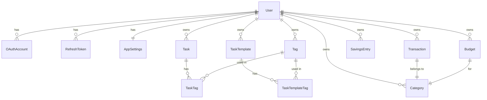

# ARCHITECTURE.md — MyDay

Справочник по архитектурным решениям, связям в БД и зонам риска. Правила работы и повседневные конвенции — в `CLAUDE.md`. Открывай этот файл при работе с БД, security-логикой или перед рефакторингом, задевающим что-то из списка ниже.

---

## Архитектура БД

### Ключевые решения

| Решение | Почему |
|---------|--------|
| Hard delete везде | Проект личный, нет нужды в восстановлении удалённых данных |
| `Decimal(12,2)` для денег | Float накапливает ошибки (`0.1 + 0.2 ≠ 0.3`) при агрегации |
| `date` + `createdAt` в Transaction | `date` — когда произошла транзакция (user sets), `createdAt` — когда создана запись. Фильтрация по месяцу всегда по `date` |
| Категории per-user, сидируются при регистрации | Нет nullable userId, каждый владеет своими категориями, может удалять любые |
| Tags — отдельная таблица many-to-many | Тег — сущность: можно переименовать, добавить цвет, считать статистику. `Tag.color` nullable — до появления UI цвета старые теги не ломаются |
| `SavingsEntry` отдельно от `Transaction` | Накопительный счёт не пересекается с основными финансами. Отдельная таблица = чистые запросы. `SavingsEntry` имеет `type: SavingsType (DEPOSIT \| WITHDRAWAL)` и всегда положительный `amount`. Баланс = `SUM(DEPOSIT) - SUM(WITHDRAWAL)`. Это позволяет и пополнять, и снимать с накоплений |
| Баланс накоплений — всегда total, не по месяцу | Накопления накопительные по природе: если отложил 10к в январе и 5к в феврале — итого 15к, а не 5к. Фильтр по месяцу применяется только к истории записей, не к балансу. `GET /api/finance/savings` возвращает `{ balance, entries }` где `balance` = SUM за всё время |
| `RefreshToken` в БД с bcrypt-хешем | Инвалидация токенов при logout/смене пароля. Хеш — если БД утечёт, сырые токены не скомпрометированы |
| `shared/` для типов и Zod | Единственный способ шарить код между client и server в Nuxt без хаков |
| Агрегация finance на сервере | SQL SUM/GROUP BY быстрее чем JS reduce на 500 записях |
| PIN — UI lock, не второй фактор | Пользователь аутентифицирован, PIN только блокирует интерфейс. Хеш в `AppSettings`, валидация на клиенте без сетевого запроса. Сброс — через провайдера регистрации (Google re-auth или пароль аккаунта). Осознанный компромисс: хеш 4-значного PIN на клиенте брутится оффлайн — допустимо только потому что PIN не граница безопасности |
| `SavingsEntry` без поля `date` | Копилке важно движение средств, а не точная дата события — бэкдейт не поддерживаем (осознанно). История сортируется по `createdAt` |
| Таймзоны: сервер TZ-agnostic | «Сегодня» и границы месяца определяет клиент в своей таймзоне и передаёт `from`/`to` (ISO, UTC) в query. Сервер не делает дата-математику от собственного `new Date()` — у москвича и нью-йоркца «сегодня» разное |
| Удаление категории → переназначение на «Другое» (решение 28.07.2026) | Каждому пользователю сидируются две системные категории «Другое» (EXPENSE и INCOME) с флагом `isSystem` — их нельзя удалить и сменить тип. При удалении обычной категории её транзакции переназначаются на «Другое» того же типа, бюджеты категории удаляются — всё в одной `$transaction`. История и итоги прошлых месяцев не меняются. Альтернатива (каскад) отвергнута: удаление категории — операция над таксономией, а не над финансовой историей. Реализация: **4.5.0** (см. `ROADMAP.md`) |
| Budgets и Notifications — отложены до v2 (решение 28.07.2026) | MVP = Tasks + Finance (транзакции, периоды, фильтры, savings). Дата-слой бюджетов (модель, API, хуки) уже существует — не удалять и не ломать; таб Budgets скрыт из UiPillSelect. План v2 — Фаза 7 (см. `ROADMAP.md`) |

### Диаграмма связей



### Auth Flow

```mermaid
sequenceDiagram
    participant C as Client
    participant S as Server
    participant DB as Database
    participant G as Google

    Note over C,G: Email/Password регистрация
    C->>S: POST /api/auth/register {name, email, password}
    S->>S: Zod validation
    S->>DB: Create User + AppSettings + seed Categories
    S->>DB: Create RefreshToken (hashed)
    S-->>C: {accessToken} + Set-Cookie: refreshToken (httpOnly)

    Note over C,G: Google OAuth
    C->>S: GET /api/auth/oauth/google
    S-->>C: redirect → Google consent
    C->>G: user consents
    G-->>S: GET /callback?code=xxx
    S->>G: exchange code → tokens + profile
    S->>DB: Upsert User + OAuthAccount
    S-->>C: {accessToken} + Set-Cookie: refreshToken

    Note over C,S: Защищённый запрос
    C->>S: GET /api/tasks + Authorization: Bearer <accessToken>
    S->>S: middleware/01.auth.ts verifies JWT
    S-->>C: tasks data

    Note over C,S: Token refresh (автоматически при 401)
    C->>S: POST /api/auth/refresh (cookie отправляется браузером)
    S->>DB: find RefreshToken by hash, check expiresAt
    S->>DB: rotate — delete old, create new
    S-->>C: {accessToken} + новый refreshToken cookie

    Note over C,S: Logout
    C->>S: POST /api/auth/logout
    S->>DB: delete RefreshToken
    S-->>C: Set-Cookie: refreshToken=; Max-Age=0
```

### Зоны риска — нельзя менять без рефакторинга

| Решение | Что сломается при изменении |
|---------|----------------------------|
| `Decimal` для `amount` | Все агрегации, сравнения, отображение |
| `date` поле в Transaction | Вся фильтрация по месяцу/периоду |
| `userId` в каждом WHERE | Утечка данных между пользователями (security) |
| `shared/` для типов и схем | Дублирование валидации или импорт-хаки |
| httpOnly cookie для refreshToken | XSS-уязвимость если переехать в localStorage |
| Per-user категории (сид при регистрации) | Data migration + изменение всех запросов |
| `SavingsEntry` отдельно от `Transaction` | Data migration если объединить |
| Нумерация middleware (`01.auth.ts`) | Порядок выполнения в Nitro |

### Известные баги

- `toPublicUser` (`server/utils/mapper.ts`) — двойное вложение: клиент получает `user.settings.settings.*` (ответы login/register/me)
- `GET /api/finance/transactions` игнорирует даты → чинится в **2.17** (см. `ROADMAP.md`)
- Нет проверки принадлежности `categoryId` → чинится в **2.18** (см. `ROADMAP.md`)
- `createCategorySchema`/`updateCategorySchema` без `color` → чинится в **4.5.1** (см. `ROADMAP.md`)

Хронология обсуждений — в `context/` (gitignored).
