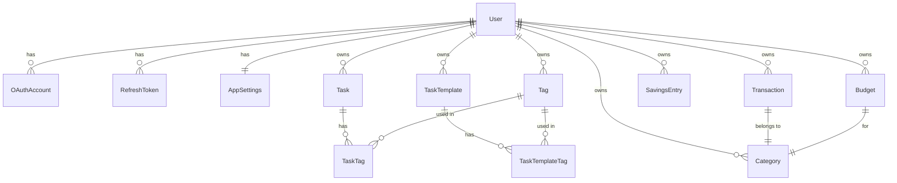

# ARCHITECTURE.md — MyDay

Справочник по архитектурным решениям, связям в БД и зонам риска. Правила работы и повседневные конвенции — в `CLAUDE.md`. Открывай этот файл при работе с БД, security-логикой или перед рефакторингом, задевающим что-то из списка ниже.

---

## Архитектура БД

### Ключевые решения

| Решение | Почему |
|---------|--------|
| Hard delete везде | Проект личный, нет нужды в восстановлении удалённых данных |
| `Decimal(12,2)` для денег | Float накапливает ошибки (`0.1 + 0.2 ≠ 0.3`) при агрегации |
| `date` + `createdAt` в Transaction | `date` — когда произошла транзакция (user sets), `createdAt` — когда создана запись. Фильтрация по месяцу всегда по `date` |
| Категории per-user, сидируются при регистрации | Нет nullable userId, каждый владеет своими категориями, может удалять любые |
| Tags — отдельная таблица many-to-many | Тег — сущность: можно переименовать, добавить цвет, считать статистику. `Tag.color` nullable — до появления UI цвета старые теги не ломаются |
| `SavingsEntry` отдельно от `Transaction` | Накопительный счёт не пересекается с основными финансами. Отдельная таблица = чистые запросы. `SavingsEntry` имеет `type: SavingsType (DEPOSIT \| WITHDRAWAL)` и всегда положительный `amount`. Баланс = `SUM(DEPOSIT) - SUM(WITHDRAWAL)`. Это позволяет и пополнять, и снимать с накоплений |
| Баланс накоплений — всегда total, не по месяцу | Накопления накопительные по природе: если отложил 10к в январе и 5к в феврале — итого 15к, а не 5к. Фильтр по месяцу применяется только к истории записей, не к балансу. `GET /api/finance/savings` возвращает `{ balance, entries }` где `balance` = SUM за всё время |
| `RefreshToken` в БД с bcrypt-хешем | Инвалидация токенов при logout/смене пароля. Хеш — если БД утечёт, сырые токены не скомпрометированы |
| `shared/` для типов и Zod | Единственный способ шарить код между client и server в Nuxt без хаков |
| Агрегация finance на сервере | SQL SUM/GROUP BY быстрее чем JS reduce на 500 записях |
| PIN — UI lock, не второй фактор | Пользователь аутентифицирован, PIN только блокирует интерфейс. Хеш в `AppSettings`, валидация на клиенте без сетевого запроса. Сброс — через провайдера регистрации (Google re-auth или пароль аккаунта). Осознанный компромисс: хеш 4-значного PIN на клиенте брутится оффлайн — допустимо только потому что PIN не граница безопасности |
| `SavingsEntry` без поля `date` | Копилке важно движение средств, а не точная дата события — бэкдейт не поддерживаем (осознанно). История сортируется по `createdAt`. Следствие (2.23): период истории и delta считаются по `createdAt` — это настоящий timestamp, а не `@db.Date`, поэтому границы берутся по UTC: `createdAt >= from 00:00Z` и `< to + 1 день 00:00Z`. У пользователя в UTC+3 запись, созданная в 01:00 первого числа, попадёт в предыдущий месяц. Мириться с этим дешевле, чем заводить у копилки собственную календарную дату ради нескольких пограничных часов |
| Таймзоны: сервер TZ-agnostic | «Сегодня» и границы месяца определяет клиент в своей таймзоне и передаёт `from`/`to` в query. Сервер не делает дата-математику от собственного `new Date()` — у москвича и нью-йоркца «сегодня» разное |
| Календарная дата на проводе — всегда `YYYY-MM-DD` (решение 10.09.2026, распространено на `Task.dueDate` 14.09.2026) | `Transaction.date`, `Budget.month` и `Task.dueDate` — `@db.Date`, то есть календарный день без времени. Поэтому и в query (`from`/`to`), и в body (`date`) ходит date-only строка, посчитанная клиентом в его таймзоне (`toDateString()` в `app/utils/formatDate.ts`). Полный ISO datetime отвергается схемой с 400. Почему: `new Date().toISOString()` отдаёт UTC-мгновение, и Postgres обрезал его до UTC-дня — в UTC−7 любая вечерняя транзакция уезжала на следующий день, а 31-го числа — в следующий месяц. Обратная сторона того же правила: date-only значение нельзя читать через локальные геттеры `new Date(...)` — форматтеры в `app/utils/formatDate.ts` разбирают такую строку как календарную дату, группировка по дням берёт ключ через `toDayKey` (срез строки, а не локальные геттеры) |
| Удаление категории → переназначение на «Другое» (решение 28.07.2026) | Каждому пользователю сидируются две системные категории «Другое» (EXPENSE и INCOME) с флагом `isSystem` — их нельзя удалить и сменить тип. При удалении обычной категории её транзакции переназначаются на «Другое» того же типа, бюджеты категории удаляются — всё в одной `$transaction`. История и итоги прошлых месяцев не меняются. Альтернатива (каскад) отвергнута: удаление категории — операция над таксономией, а не над финансовой историей. Реализация: **4.5.0** (см. `ROADMAP.md`) |
| Тип транзакции и тип категории обязаны совпадать (решение 11.09.2026) | `Transaction.type` и `Category.type` — независимые поля, FK их не связывает, и EXPENSE под «Salary» молча искажал бы breakdown и итоги. Проверяется в хендлере (400): POST сверяет пару, PATCH — *итоговую* пару после применения патча, поэтому сменить тип транзакции можно только вместе с категорией. В UI это уже так: сетка категорий фильтруется по типу (DESIGN.md → TransactionEditSheet) |
| Summary и список транзакций делят один фильтр-контракт (решение 11.09.2026) | `GET /api/finance/summary` принимает те же `from`/`to`/`type`/`categoryIds`/`search`, что и `GET /api/finance/transactions`: схема `transactionFilterQuerySchema` (список = она же плюс `page`/`limit`) и один построитель WHERE — `server/utils/transactionWhere.ts`. Иначе hero и breakdown считались бы по одному набору, а список под ними — по другому. `breakdown` остаётся разбивкой **расходов** («Spend by category» в дизайне): при `type=INCOME` он пустой, а не превращается в разбивку доходов. Тот же эндпоинт закрывает `ResultSummary` в All Transactions (2.21) |
| Ответ 404 на чужой или отсутствующий ресурс (решение 11.09.2026) | Одиночные `PATCH`/`DELETE` ограничены `where: { id, userId }`, поэтому чужая запись и несуществующая неотличимы — обе дают Prisma P2025, и обе должны отдавать 404, а не 500 и не 403: по коду ответа нельзя узнать, существует ли чужой id. Маппинг — `orNotFound`/`orConflict` в `server/utils/dbError.ts`, один идиом на все ресурсы |
| Названия сидовых категорий локализуются через `key`, а не переводом строк в БД (решение 11.09.2026) | Категории — данные пользователя (их переименовывают), поэтому в БД лежит `name`, и сидовые приходили только на английском. Решение: у сидовых категорий будет `Category.key` (`food`, `transport`, …), и UI показывает `t('categories.<key>')`; как только пользователь меняет `name`, `key` обнуляется и дальше показывается его текст. Так переключение языка переводит нетронутые категории, а свои и переименованные остаются как есть. Отвергнуто: сеять на языке регистрации (существующие строки и смена языка не чинятся) и хранить пару `nameEn`/`nameRu` (не работает для пользовательских категорий). Реализация: **4.5.0** — одной миграцией с `isSystem` |
| Budgets и Notifications — отложены до v2 (решение 28.07.2026) | MVP = Tasks + Finance (транзакции, периоды, фильтры, savings). Дата-слой бюджетов (модель, API, хуки) уже существует — не удалять и не ломать; таб Budgets скрыт из UiPillSelect. План v2 — Фаза 7 (см. `ROADMAP.md`) |

### Диаграмма связей



### Auth Flow

```mermaid
sequenceDiagram
    participant C as Client
    participant S as Server
    participant DB as Database
    participant G as Google

    Note over C,G: Email/Password регистрация
    C->>S: POST /api/auth/register {name, email, password}
    S->>S: Zod validation
    S->>DB: Create User + AppSettings + seed Categories
    S->>DB: Create RefreshToken (hashed)
    S-->>C: {accessToken} + Set-Cookie: refreshToken (httpOnly)

    Note over C,G: Google OAuth
    C->>S: GET /api/auth/oauth/google
    S-->>C: redirect → Google consent
    C->>G: user consents
    G-->>S: GET /callback?code=xxx
    S->>G: exchange code → tokens + profile
    S->>DB: Upsert User + OAuthAccount
    S-->>C: {accessToken} + Set-Cookie: refreshToken

    Note over C,S: Защищённый запрос
    C->>S: GET /api/tasks + Authorization: Bearer <accessToken>
    S->>S: middleware/01.auth.ts verifies JWT
    S-->>C: tasks data

    Note over C,S: Token refresh (автоматически при 401)
    C->>S: POST /api/auth/refresh (cookie отправляется браузером)
    S->>DB: find RefreshToken by hash, check expiresAt
    S->>DB: rotate — delete old, create new
    S-->>C: {accessToken} + новый refreshToken cookie

    Note over C,S: Logout
    C->>S: POST /api/auth/logout
    S->>DB: delete RefreshToken
    S-->>C: Set-Cookie: refreshToken=; Max-Age=0
```

### Зоны риска — нельзя менять без рефакторинга

| Решение | Что сломается при изменении |
|---------|----------------------------|
| `Decimal` для `amount` | Все агрегации, сравнения, отображение |
| `date` поле в Transaction | Вся фильтрация по месяцу/периоду |
| `userId` в каждом WHERE | Утечка данных между пользователями (security) |
| `shared/` для типов и схем | Дублирование валидации или импорт-хаки |
| httpOnly cookie для refreshToken | XSS-уязвимость если переехать в localStorage |
| Per-user категории (сид при регистрации) | Data migration + изменение всех запросов |
| `SavingsEntry` отдельно от `Transaction` | Data migration если объединить |
| Нумерация middleware (`01.auth.ts`) | Порядок выполнения в Nitro |
| Хук `close` в `nuxt.config.ts` | `nuxt build` перестанет завершаться — см. «Известные баги» |

### Известные баги

- `createBudgetSchema.month` — полный ISO datetime, тогда как GET-фильтр бюджетов date-only. Привести к общему контракту в **Фазе 7** (бюджеты отложены; ломать рабочий write-путь сейчас незачем)
- **`nuxt build` не завершался после успешной сборки** (найдено 14.09.2026 при настройке CI). Печатал `✨ Build complete!` и висел бесконечно: процесс оставался живым, CPU на нуле. Проба через `process.getActiveResourcesInfo()` показала единственный удерживающий ресурс — `ProcessWrap`, то есть дочерний процесс `esbuild --service --ping`, который не отпускают. Причина внешняя, в цепочке `@nuxt/ui → @nuxt/fonts → fontless` ([nuxt#33987](https://github.com/nuxt/nuxt/issues/33987)); бисект по модулям подтвердил, что `@nuxt/eslint` ни при чём. Обход — хук `close` в `nuxt.config.ts`, форсирующий выход:

  ```ts
  hooks: {
    close: (nuxt) => {
      if (!nuxt.options.dev && !nuxt.options.test) process.exit(process.exitCode ?? 0)
    }
  }
  ```

  Все три условия несущие, не косметические — каждое закрывает проверенный на практике способ выстрелить себе в ногу:

  - `!nuxt.options.dev` — `close` срабатывает и при перезапусках дев-сервера, безусловный выход убивал бы `pnpm dev` на каждое изменение конфига;
  - `!nuxt.options.test` — `@nuxt/test-utils` тоже поднимает и закрывает Nuxt-инстанс, причём с `dev: false`. Без этого условия `pnpm test` завершался **молча и с кодом 0, не выполнив ни одного теста**. В CI это опаснее исходного зависания: job зелёный, тестов ноль;
  - `process.exitCode ?? 0` — чтобы не затереть ненулевой код упавшей сборки. Проверено на заведомо нерезолвящемся импорте: падение по-прежнему даёт `EXIT=1`.

  Снимать обход — только убедившись, что `nuxt build` выходит сам, и после повторного прогона `pnpm test` с подсчётом тестов, а не одного лишь кода выхода.

Хронология обсуждений — в `context/` (gitignored).
