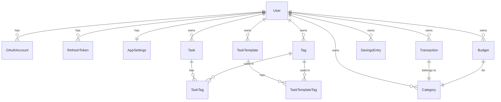

# ARCHITECTURE.md — MyDay

Справочник по архитектурным решениям, связям в БД и зонам риска. Правила работы и повседневные конвенции — в `CLAUDE.md`. Открывай этот файл при работе с БД, security-логикой или перед рефакторингом, задевающим что-то из списка ниже.

---

## Архитектура БД

### Ключевые решения

| Решение | Почему |
|---------|--------|
| Hard delete везде | Проект личный, нет нужды в восстановлении удалённых данных |
| `Decimal(12,2)` для денег | Float накапливает ошибки (`0.1 + 0.2 ≠ 0.3`) при агрегации |
| `date` + `createdAt` в Transaction | `date` — когда произошла транзакция (user sets), `createdAt` — когда создана запись. Фильтрация по месяцу всегда по `date` |
| Категории per-user, сидируются при регистрации | Нет nullable userId, каждый владеет своими категориями, может удалять любые |
| Tags — отдельная таблица many-to-many | Тег — сущность: можно переименовать, добавить цвет, считать статистику. `Tag.color` nullable — до появления UI цвета старые теги не ломаются |
| `SavingsEntry` отдельно от `Transaction` | Накопительный счёт не пересекается с основными финансами. Отдельная таблица = чистые запросы. `SavingsEntry` имеет `type: SavingsType (DEPOSIT \| WITHDRAWAL \| OPENING)` и всегда положительный `amount`. Баланс = `OPENING + SUM(DEPOSIT) - SUM(WITHDRAWAL)`. Это позволяет и пополнять, и снимать с накоплений |
| Баланс накоплений — всегда total, не по месяцу | Накопления накопительные по природе: если отложил 10к в январе и 5к в феврале — итого 15к, а не 5к. Фильтр по месяцу применяется только к истории записей, не к балансу. `GET /api/finance/savings` возвращает `{ balance, delta, opening, entries }` где `balance` = SUM за всё время |
| `OPENING` — стартовый остаток, не пополнение (08.10.2026) | Деньги, которые уже были до начала учёта. Входят в `balance`, но не в `delta`: `delta = SUM(DEPOSIT) - SUM(WITHDRAWAL)` за период, без периода — за всё время. Иначе первый ввод 245к становился «+245к», и бейдж оставался в плюсе, даже когда с этих денег только снимали. Один на пользователя (второй — 409); сумму и заметку можно поправить через `PATCH`, тип записи не меняется. `opening: null` в ответе — признак «ещё не задан», по нему UI показывает ссылку «Указать стартовый остаток» |
| `RefreshToken` в БД с bcrypt-хешем | Инвалидация токенов при logout/смене пароля. Хеш — если БД утечёт, сырые токены не скомпрометированы |
| `shared/` для типов и Zod | Единственный способ шарить код между client и server в Nuxt без хаков |
| Агрегация finance на сервере | SQL SUM/GROUP BY быстрее чем JS reduce на 500 записях |
| PIN — UI lock, не второй фактор | Пользователь аутентифицирован, PIN только блокирует интерфейс. Хеш в `AppSettings` и **клиенту не отдаётся**: bcrypt-хеш четырёхзначного кода перебирается офлайн за секунды. Проверка — `POST /api/settings/pin/verify` с лимитом на неудачные попытки. Сброс — через провайдера регистрации (Google re-auth или пароль аккаунта). Подробности — раздел «PIN-блокировка» ниже |
| `SavingsEntry` без поля `date` | Копилке важно движение средств, а не точная дата события — бэкдейт не поддерживаем (осознанно). История сортируется по `createdAt`. Следствие (2.23): период истории и delta считаются по `createdAt` — это настоящий timestamp, а не `@db.Date`, поэтому границы берутся по UTC: `createdAt >= from 00:00Z` и `< to + 1 день 00:00Z`. У пользователя в UTC+3 запись, созданная в 01:00 первого числа, попадёт в предыдущий месяц. Мириться с этим дешевле, чем заводить у копилки собственную календарную дату ради нескольких пограничных часов |
| Таймзоны: сервер TZ-agnostic | «Сегодня» и границы месяца определяет клиент в своей таймзоне и передаёт `from`/`to` в query. Сервер не делает дата-математику от собственного `new Date()` — у москвича и нью-йоркца «сегодня» разное |
| Календарная дата на проводе — всегда `YYYY-MM-DD` (решение 10.09.2026, распространено на `Task.dueDate` 14.09.2026) | `Transaction.date`, `Budget.month` и `Task.dueDate` — `@db.Date`, то есть календарный день без времени. Поэтому и в query (`from`/`to`), и в body (`date`) ходит date-only строка, посчитанная клиентом в его таймзоне (`toDateString()` в `app/utils/formatDate.ts`). Полный ISO datetime отвергается схемой с 400. Почему: `new Date().toISOString()` отдаёт UTC-мгновение, и Postgres обрезал его до UTC-дня — в UTC−7 любая вечерняя транзакция уезжала на следующий день, а 31-го числа — в следующий месяц. Обратная сторона того же правила: date-only значение нельзя читать через локальные геттеры `new Date(...)` — форматтеры в `app/utils/formatDate.ts` разбирают такую строку как календарную дату, группировка по дням берёт ключ через `toDayKey` (срез строки, а не локальные геттеры) |
| Удаление категории → переназначение на «Другое» (решение 28.07.2026) | Каждому пользователю сидируются две системные категории «Другое» (EXPENSE и INCOME) с флагом `isSystem` — их нельзя удалить и сменить тип. При удалении обычной категории её транзакции переназначаются на «Другое» того же типа, бюджеты категории удаляются — всё в одной `$transaction`. История и итоги прошлых месяцев не меняются. Альтернатива (каскад) отвергнута: удаление категории — операция над таксономией, а не над финансовой историей. Реализовано в **4.5.0** |
| Тип транзакции и тип категории обязаны совпадать (решение 11.09.2026) | `Transaction.type` и `Category.type` — независимые поля, FK их не связывает, и EXPENSE под «Salary» молча искажал бы breakdown и итоги. Проверяется в хендлере (400): POST сверяет пару, PATCH — *итоговую* пару после применения патча, поэтому сменить тип транзакции можно только вместе с категорией. В UI это уже так: сетка категорий фильтруется по типу (DESIGN.md → TransactionEditSheet) |
| Summary и список транзакций делят один фильтр-контракт (решение 11.09.2026) | `GET /api/finance/summary` принимает те же `from`/`to`/`type`/`categoryIds`/`search`, что и `GET /api/finance/transactions`: схема `transactionFilterQuerySchema` (список = она же плюс `page`/`limit`) и один построитель WHERE — `server/utils/transactionWhere.ts`. Иначе hero и breakdown считались бы по одному набору, а список под ними — по другому. `breakdown` следует за фильтром типа (пересмотрено 08.10.2026): при `type=INCOME` — разбивка **доходов**, иначе — **расходов** («Spend by category»). Тип отдаётся полем `breakdownType`: по нему вёрстка берёт базу для процентов (`income`/`expense`) и заголовок, а `dropFromSummary` патчит breakdown только транзакцией того же типа. Раньше при `type=INCOME` breakdown был пустым, и таб «Доходы» показывал ложное «Нет данных за этот период». Тот же эндпоинт закрывает `ResultSummary` в All Transactions (2.21) |
| Ответ 404 на чужой или отсутствующий ресурс (решение 11.09.2026) | Одиночные `PATCH`/`DELETE` ограничены `where: { id, userId }`, поэтому чужая запись и несуществующая неотличимы — обе дают Prisma P2025, и обе должны отдавать 404, а не 500 и не 403: по коду ответа нельзя узнать, существует ли чужой id. Маппинг — `orNotFound`/`orConflict` в `server/utils/dbError.ts`, один идиом на все ресурсы |
| Названия сидовых категорий локализуются через `key`, а не переводом строк в БД (решение 11.09.2026) | Категории — данные пользователя (их переименовывают), поэтому в БД лежит `name`, и сидовые приходили только на английском. Решение: у сидовых категорий будет `Category.key` (`food`, `transport`, …), и UI показывает `t('categories.<key>')`; как только пользователь меняет `name`, `key` обнуляется и дальше показывается его текст. Так переключение языка переводит нетронутые категории, а свои и переименованные остаются как есть. Отвергнуто: сеять на языке регистрации (существующие строки и смена языка не чинятся) и хранить пару `nameEn`/`nameRu` (не работает для пользовательских категорий). Реализовано в **4.5.0** одной миграцией с `isSystem` |
| Soft delete с корзиной на 30 дней вместо жёсткого удаления (решение 09.10.2026) | `Task`, `Transaction` и `SavingsEntry` удаляются проставлением `deletedAt`. Это закрывает сразу две задачи: «Отменить» в тосте — обычный `POST …/:id/restore`, а случайный свайп можно откатить и через месяц из «Недавно удалённых». Отвергнуто: откладывать `DELETE` на клиенте на 5 секунд — любой рефетч в это окно возвращал бы ещё не удалённую строку в список, а выгруженная iOS PWA не отправила бы запрос вовсе. Теги, шаблоны и категории удаляются жёстко: тег — метка, шаблон дешевле пересоздать, у категорий свой перенос транзакций. Подробности — «Корзина и undo» ниже |
| Budgets и Notifications — отложены до v2 (решение 28.07.2026) | MVP = Tasks + Finance (транзакции, периоды, фильтры, savings). Дата-слой бюджетов (модель, API, хуки) уже существует — не удалять и не ломать; таб Budgets скрыт из UiPillSelect. План v2 — Фаза 7 (см. `ROADMAP.md`) |

### Диаграмма связей


```mermaid
erDiagram
    User ||--o{ OAuthAccount : "has"
    User ||--o{ RefreshToken : "has"
    User ||--|| AppSettings : "has"
    User ||--o{ Task : "owns"
    User ||--o{ TaskTemplate : "owns"
    User ||--o{ Tag : "owns"
    User ||--o{ Transaction : "owns"
    User ||--o{ SavingsEntry : "owns"
    User ||--o{ Category : "owns"
    User ||--o{ Budget : "owns"

    Task ||--o{ TaskTag : "has"
    Tag  ||--o{ TaskTag : "used in"

    TaskTemplate ||--o{ TaskTemplateTag : "has"
    Tag          ||--o{ TaskTemplateTag : "used in"

    Transaction ||--|| Category : "belongs to"
    Budget      ||--|| Category : "for"
```

### Auth Flow

```mermaid
sequenceDiagram
    participant C as Client
    participant S as Server
    participant DB as Database
    participant G as Google

    Note over C,G: Email/Password регистрация
    C->>S: POST /api/auth/register {name, email, password}
    S->>S: Zod validation
    S->>DB: Create User + AppSettings + seed Categories
    S->>DB: Create RefreshToken (hashed)
    S-->>C: {accessToken} + Set-Cookie: refreshToken (httpOnly)

    Note over C,G: Google OAuth
    C->>S: GET /api/auth/oauth/google
    S-->>C: redirect → Google consent
    C->>G: user consents
    G-->>S: GET /callback?code=xxx
    S->>G: exchange code → tokens + profile
    S->>DB: Upsert User + OAuthAccount
    S-->>C: {accessToken} + Set-Cookie: refreshToken

    Note over C,S: Защищённый запрос
    C->>S: GET /api/tasks + Authorization: Bearer <accessToken>
    S->>S: middleware/01.auth.ts verifies JWT
    S-->>C: tasks data

    Note over C,S: Token refresh (автоматически при 401)
    C->>S: POST /api/auth/refresh (cookie отправляется браузером)
    S->>DB: find RefreshToken by hash, check expiresAt
    S->>DB: rotate — delete old, create new
    S-->>C: {accessToken} + новый refreshToken cookie

    Note over C,S: Logout
    C->>S: POST /api/auth/logout
    S->>DB: delete RefreshToken
    S-->>C: Set-Cookie: refreshToken=; Max-Age=0
```

### Зоны риска — нельзя менять без рефакторинга

| Решение | Что сломается при изменении |
|---------|----------------------------|
| `Decimal` для `amount` | Все агрегации, сравнения, отображение |
| `date` поле в Transaction | Вся фильтрация по месяцу/периоду |
| `userId` в каждом WHERE | Утечка данных между пользователями (security) |
| `shared/` для типов и схем | Дублирование валидации или импорт-хаки |
| httpOnly cookie для refreshToken | XSS-уязвимость если переехать в localStorage |
| Per-user категории (сид при регистрации) | Data migration + изменение всех запросов |
| `SavingsEntry` отдельно от `Transaction` | Data migration если объединить |
| `deletedAt: null` во всех чтениях и `PATCH` у `Task`, `Transaction`, `SavingsEntry` | Удалённое всплывёт в списках, `summary`, балансе копилки, и его можно будет отредактировать из корзины. Для транзакций фильтр живёт в `transactionWhere`, у копилки — в обоих `groupBy` и в проверке единственного `OPENING` |
| Нумерация middleware (`01.auth.ts`) | Порядок выполнения в Nitro |
| Хук `close` в `nuxt.config.ts` | `nuxt build` перестанет завершаться — см. «Известные баги» |
| `clearApiCache()` в `authStore.logout()` | Ответы API прошлого пользователя останутся в кэше service worker и достанутся следующему — см. ниже |
| `pages/settings/index.vue`, а не `pages/settings.vue` | Файл-страница рядом с одноимённой папкой становится вложенным роут-родителем: без `<NuxtPage />` внутри дочерние страницы не рендерятся, а URL при этом меняется |
| Уникальный индекс `[userId, name, type]` у `Category` | Вернёшь `[userId, name]` — вторая системная «Другое» (INCOME) перестанет ложиться при регистрации |
| Ранний выход и дедупликация в `authStore.init()` | `/api/auth/refresh` ротирует токен — повторный вызов ротирует ещё раз, параллельный упадёт на удалённой строке |
| `await authStore.init()` внутри `middleware/auth.ts` | Мидлвар идёт раньше `app.vue`; без ожидания жёсткая перезагрузка защищённой страницы выкидывает на `/auth/welcome` с валидной кукой |
| Порядок `:root[data-accent]` → `.light[data-accent]` в `main.css` | Селекторы равны по специфичности; поменяешь местами — светлая тема потеряет выбранный акцент |
| `themeSurfaces` в `useTheme.ts` | Дублирует `--c-bg` обеих тем для мета-тега `theme-color` — правится вместе с CSS |
| Полоса-подложка `top-full` под `UiSheet` | `ease-spring` перелетает конечную точку; уберёшь — при открытии под шитом мигает дыра до низа экрана |
| `@click.capture` в `UiSwipeRow` | Браузер шлёт `click` после свайпа; уберёшь — свайп по строке снова будет открывать шит редактирования |
| `setPointerCapture` только при `axis === 'x'` | Захват на `pointerdown` перенацеливает и совместимые mouse-события: `click` уйдёт на строку, а не на вложенную кнопку, и чекбоксы внутри строк перестанут работать |
| `prime()` в `lock.global.ts`, а не вотчер | Вотчер на профиле срабатывает позже навигации роутера — после перезагрузки заблокированное приложение остаётся открытым |
| Таймер замка на уровне модуля в `useAppLock.ts` | Вернёшь в замыкание — `unlock()` со страницы PIN заведёт свой таймер, который активность не сбрасывает: экран блокируется через 5 минут после ввода PIN посреди работы |
| Отсутствие `pinHash` в `toPublicSettings()` | Вернёшь — bcrypt-хеш четырёхзначного PIN уедет в браузер и в кэш service worker, где перебирается офлайн за секунды |
| Глобальный `auth.global.ts` вместо `middleware: 'auth'` на странице | Поштучная навеска уже дважды приводила к незащищённым страницам; новую страницу забудут пометить, и она откроется анониму |
| Защёлка `restored` в `authStore.init()` | Уберёшь — глобальный мидлвар будет слать `/api/auth/refresh` на каждую навигацию анонима |
| `viewport-fit=cover` в мета-теге viewport | Без него `env(safe-area-inset-*)` возвращает нули: `pb-safe`/`pt-safe` молча перестают работать, а `black-translucent` статус-бар заезжает на контент |
| `secure: !import.meta.dev` у refresh-куки | Вернёшь безусловный `secure: true` — на `http://<LAN-IP>` браузер молча выбросит куку, и сессия перестанет переживать перезагрузку на телефоне |
| Никаких secure-context API в dev-путях | `crypto.randomUUID`, `navigator.clipboard` и подобные отсутствуют на `http://<LAN-IP>`: вызов бросает, и если он внутри `onSuccess`, отменяются колбэки мутации |
| Сверка идентичности в `useFabAction()` | Снимешь — уходящая страница затрёт действие входящей, и FAB перестанет открывать шит после перехода по табу |
| Повтор запроса после 401 в `useApi()` | Уберёшь — приложение умирает через 15 минут: мутации падают, шиты не закрываются, тостов об успехе нет |
| 403 (не 401) на неверный PIN и пароль | Вернёшь 401 — `useApi()` примет опечатку за протухший токен, зря ротирует refresh и удвоит запросы |
| Счётчик попыток внутри `assertPin()` | Вынесешь обратно в middleware — либо успешные действия начнут тратить лимит, либо `DELETE /api/settings/pin` снова станет каналом для перебора |
| `bottom-fab` / `bottom-toast` / `pb-shell` вместо чисел | Высота таб-бара растёт на `env(safe-area-inset-bottom)`; фиксированные `bottom-[100px]` и `pb-28` загоняют FAB под бар на устройствах с вырезом |
| Случайные `uniqueEmail()` и `fakeIp()` в `tests/e2e/helpers.ts` | Счётчик модуля у каждого воркера Playwright свой и стартует с единицы: два воркера в одну миллисекунду регистрировали один и тот же email (P2002) и делили бакет rate limit — падала случайная спека |
| `vite.optimizeDeps.include` в `nuxt.config.ts` | Без него Vite находит `@tanstack/vue-query` и `zod` только на первом запросе холодного dev-сервера и перезагружает страницу. В E2E это рвёт отправку формы регистрации («Something went wrong»), и падает случайная спека — в CI кэш холодный всегда. Новую тяжёлую зависимость, которую грузит клиент, добавляй туда же |
| `min-w-0` + `grid-cols-2` у полей периода | Flex-элемент не сжимается меньше содержимого, а заполненный `input[type=date]` на iOS шире колонки — поля наезжают друг на друга |
| `appearance-none` в `UiDateInput` | С нативным оформлением iOS Safari игнорирует `w-full` у `input[type=date]` и добавляет свой отступ — поле вылезает за правый край формы |

### Кэш service worker и приватность данных

`NetworkFirst` на `/api/*` (шаг 4.2) даёт офлайн-доступ к задачам и финансам, но Workbox формирует ключ кэша **по URL и игнорирует заголовок `Authorization`**. Для `/api/tasks` это значит, что ответ, сложенный под одним аккаунтом, будет отдан любому следующему пользователю того же браузера. Отсюда три ограничения, которые нельзя снимать по отдельности:

- `/api/auth/*` исключены из кэширования полностью — логин, refresh и logout всегда идут в сеть;
- кэшируются только GET и только ответы со статусом 200, чтобы не залипал 401;
- `authStore.logout()` вызывает `clearApiCache()` — это единственное, что реально разрывает связь между аккаунтами на общем устройстве.

Срок жизни записей — сутки, так что данные не переживают смену пользователя надолго даже без явного выхода. Если появится переключение аккаунтов без `logout()`, чистку кэша нужно повесить и на него.

### Оптимистичные апдейты в TanStack Query

Оптимистику получают только **удаление и переключение** (`useToggleTaskMutation`, `useDeleteTaskMutation`, `useDeleteTransactionMutation`, `useDeleteSavingsMutation`). Создание и редактирование живут на `invalidateQueries` в `onSuccess`, и это осознанно: сервер владеет полями, которые клиент не может вывести (`id`, `createdAt`, позиция в сортировке и пагинации, JOIN-нутые категории и теги), поэтому оптимистичная вставка показала бы строку, отличающуюся от той, что придёт с сервера.

Общий каркас — `app/utils/optimistic.ts`: `snapshotQueries` (cancel + снимок), `restoreQueries` (откат в `onError`), `invalidateWhenSettled`. Чистые функции пересчёта кэшей финансов — `app/utils/financeCache.ts`, они же покрыты юнит-тестами отдельно от хуков.

Три неочевидных момента:

- **Два кэша транзакций под одним префиксом.** `useTransactionQuery` кладёт `TransactionListResponse`, `useTransactionPagesQuery` — `InfiniteData<TransactionListResponse>`, и оба матчатся на `['transactions']`. Любой патч обязан различать формы по наличию `pages`, иначе один из экранов получит мусор.
- **`summary` правится по scope, а не по всему префиксу.** Ключи `['transactions', scope]`, `['transactions', 'pages', scope]` и `['summary', scope]` делят один `scope = { period, filters }`. Патчим только те `summary`, в чьём списке транзакция реально лежала, и дедуплицируем scope — иначе транзакция, попавшая и в плоский, и в постраничный кэш, вычтется из суммы дважды.
- **`invalidateWhenSettled` пропускает инвалидацию, пока `isMutating() > 1`.** В `onSettled` текущая мутация ещё числится `pending` (в `@tanstack/query-core` диспатч `success` идёт после колбэков), поэтому `> 1` означает «есть кто-то ещё». Без этой проверки рефетч от первого удаления возвращает строку, которую второе уже убрало оптимистично, и она мигает обратно в списке.

### Корзина и undo

`DELETE /api/tasks/:id`, `/api/finance/transactions/:id`, `/api/finance/savings/:id` только проставляют `deletedAt`, повторный вызов — 404. Восстановление — `POST …/:id/restore`, корзина — `GET /api/trash` (три списка, свежие сверху), навсегда — `DELETE /api/trash/:kind/:id` (`kind` = `task | transaction | savings`) и `DELETE /api/trash` целиком. Срок хранения — `TRASH_RETENTION_DAYS` в `shared/schemas/trash.ts`, им же клиент считает «ещё N дней».

- **Очистка ленивая.** Планировщика пока нет (7.5), поэтому просроченное вычищает `GET /api/trash` — только у вызывающего пользователя. Если корзину не открывать, удалённое лежит дольше 30 дней. С появлением 7.5 перенести `purgeExpiredTrash` в задачу планировщика. Чтобы срок не зависел от того, когда пользователь откроет корзину, `restore` пускает только записи моложе 30 дней (`inTrash()`): просроченное, но ещё не вычищенное, восстановить нельзя.
- **Удаление категории переносит и удалённые транзакции.** `updateMany` в `DELETE /api/categories/:id` намеренно без фильтра по `deletedAt`: иначе транзакция из корзины держала бы FK на категорию, а её восстановление вело бы в никуда.
- **Начальный остаток копилки.** Удалённый `OPENING` не мешает завести новый, но восстановить старый, пока есть активный, нельзя — 409, на клиенте свой текст (`toast.savings.restoreOpeningConflict`).
- **Restore-мутации инвалидируют напрямую, а не через `invalidateWhenSettled`.** Они не оптимистичны для списков, мигать нечему, а пропуск инвалидации при параллельной мутации оставил бы восстановленную строку невидимой. Оптимистичны они только для кэша `['trash']` — строка уходит из корзины сразу. По той же причине `['trash']` инвалидируется удалениями безусловно.
- **Тост с действием живёт 5 секунд** (`ACTION_TOAST_DURATION` в `stores/ui.ts`), обычный — 3. Действие закрывает тост; закрытие крестиком или по таймеру действие не запускает.

### Категории: системная «Другое», ключи и уникальность имени

Миграция `20260915134550_categories_system_and_keys` добавила `Category.isSystem` и `Category.key` и **сменила уникальный индекс** с `[userId, name]` на `[userId, name, type]`. Это не косметика, а необходимость: системных «Другое» две — под расходы и под доходы, — и под старым индексом вторая просто не легла бы. Побочно это разрешает то, чего пользователю раньше не хватало: «Подарки» могут существовать и как расход, и как доход.

Бэкфилл живёт в той же миграции: сидовые строки опознаются по английскому `name` + `type` и получают `key`, затем каждому пользователю досоздаётся недостающая `other-income`. У досозданных строк `id` — `gen_random_uuid()`, а не cuid: Postgres cuid не умеет, а колонка строковая и id непрозрачен. Побочный эффект бэкфилла: если пользователь сам завёл категорию с англоязычным сидовым именем, она тоже получит `key` и станет переводиться — на реальных данных это скорее то, чего он и хотел.

`categoryLabel(category, t)` — единственная точка, где решается, что показать. При заполненном `key` берётся `t('categories.<key>')`, **но если перевода нет, возвращается `name`**: иначе пользователь увидел бы в списке сырой `categories.food`. Переименование через `PATCH` обнуляет `key` — своё имя всегда побеждает; смена цвета или иконки ключ не трогает.

В UI имя в `CategoryEditSheet` открывается **локализованным** (`categoryLabel`), и если пользователь его не менял, на сервер уходит исходный `name` из БД. Иначе простое открытие шита у «Еда и напитки» отправило бы русскую строку как новое имя, обнулило `key` — и категория навсегда перестала бы переводиться.

`DELETE /api/categories/[id]` на системной категории отвечает 400. На обычной — в одной `$transaction` переносит транзакции на «Другое» того же типа, удаляет бюджеты категории и саму категорию. Если «Другое» почему-то нет, хендлер отвечает 409 и **ничего не удаляет**: молча осиротить транзакции хуже, чем отказать.

### Восстановление сессии и защита маршрутов

`POST /api/auth/refresh` **ротирует** refresh-токен: удаляет старую строку и ставит новую куку. Поэтому `authStore.init()` обязан выполняться ровно один раз за загрузку, иначе второй вызов ротирует токен повторно, а при гонке двух вызовов второй упадёт — строка уже удалена. Отсюда два ограничения в сторе: `init()` выходит сразу, если `accessToken` уже есть, и параллельные вызовы делят один промис `restore()`.

Это важно, потому что точек входа две: `app.vue` вызывает `init()` при монтировании, а `auth.global.ts` — до него, во время резолва маршрута. Мидлвар не может просто прочитать `isAuthenticated`: он выполняется **раньше**, чем `app.vue` успевает восстановить сессию, и на жёсткой перезагрузке защищённой страницы выкидывал бы на `/auth/welcome` даже с валидной кукой. Поэтому он сам дожидается `init()` и только потом решает.

`accessToken` живёт только в памяти и нигде не персистится — на старте он всегда `null`, так что «протухшего токена из прошлой сессии» в `init()` не бывает.

**Защита маршрутов — глобальная, и это не вкусовщина.** Сначала `auth` навешивался на страницу поштучно, и дважды получалось одно и то же: файл есть, а страницы открыты. Второй раз это нашлось только руками с телефона — `/today`, `/tasks` и `/finance` пускали анонима и показывали пустые экраны, потому что API отдавал 401, а редиректа не было. Список публичных маршрутов (`welcome`, `login`, `register`) короткий и закрытый, всё остальное закрыто по умолчанию — добавить новую страницу и забыть её защитить теперь нельзя. Обратная проверка там же: залогиненного не пускает на формы входа (бывший `guest.ts`).

**У `init()` есть защёлка, но только на ответ сервера.** Глобальный мидлвар зовёт `init()` на каждой навигации, а у анонима `accessToken` всегда `null` — без защёлки каждый переход слал бы `/api/auth/refresh`. Но защёлкивать любую ошибку нельзя: если приложение стартовало без сети, пользователь остался бы на welcome до перезагрузки. Поэтому защёлка ставится, только когда у ошибки есть `statusCode`, то есть сервер ответил «сессии нет»; обрыв транспорта оставляет попытку повторяемой.

**Access-токен живёт 15 минут, и `useApi` обязан его обновлять.** Это была самая дорогая дыра проекта: токен лежит только в памяти, refresh-кука живёт 30 дней, но после старта приложения ей никто не пользовался. Через 15 минут любое действие получало 401 — задача не создавалась, PIN «не сохранялся», шит оставался висеть, потому что `onSuccess` не наступал. Снаружи это выглядело как «тостов нет и окошки не закрываются», хотя и тосты, и `onSuccess: close` были написаны везде. Ни один тест этого не ловил: все они укладываются в 15 минут.

Теперь `useApi()` — обёртка, а не голый `$fetch.create`: на 401 она один раз зовёт `authStore.renew()` и повторяет запрос. Ровно один повтор — второй 401 уходит наверх, иначе получилась бы петля. `renew()` дедуплицирован общим промисом, как и `init()`, по той же причине: `/api/auth/refresh` **ротирует** токен, и два параллельных обновления убили бы сессию. Если refresh не прошёл — сессия чистится и пользователь уезжает на `/auth/welcome`, чтобы приложение не осталось в состоянии «залогинен, но всё падает».

**401 принадлежит сессии, неверный секрет — это 403.** Как только `useApi()` начал обновлять токен на 401, код перестал быть просто «ошибкой»: он стал командой «обнови сессию и повтори». А `assertPin()` отвечал тем же 401 на неверный PIN — и каждая опечатка тянула за собой ротацию refresh-токена и второй запрос (замерено: 3 запроса вместо 1). Теперь «не тот PIN» и «не тот пароль» — 403: сессия жива, просто секрет не подошёл. Правило на будущее: **внутри защищённых эндпоинтов 401 бросает только `01.auth.ts`**.

**Неудачные попытки секрета считаются в `assertPin()`, а не в middleware.** Сначала лимит висел на путях, но путь не знает результата: успешное включение PIN съедало попытку наравне с перебором, а `DELETE /api/settings/pin` вообще не был закрыт — через выключение PIN перебирался без ограничений. Счётчик переехал туда, где известен исход: бакет `<userId>:secret` общий для проверки, выключения, смены и сброса, тратится только на неудачах, 10 за 5 минут.

**Refresh-кука в разработке идёт без `Secure`.** Флаг был захардкожен в `true` во всех четырёх auth-хендлерах. На `http://localhost` это работает — браузеры считают localhost доверенным origin'ом, — а на `http://192.168.0.22` с телефона браузер куку молча выбрасывает, и сессия не переживала ни одной перезагрузки. Опции куки собраны в `server/utils/authCookie.ts` одним местом, `secure` теперь `!import.meta.dev`. В проде ничего не меняется.

**Безопасные зоны требуют `viewport-fit=cover`.** Без него `env(safe-area-inset-*)` возвращает нули, и `pb-safe`/`pt-safe` не делают ничего — при этом ничего не ломается визуально в обычной вкладке браузера, поэтому пропажа незаметна до установки на домашний экран. Вместе с `apple-mobile-web-app-status-bar-style: black-translucent` отсутствие инсета сверху означает, что в standalone контент уезжает под часы.

### Тема и акцент

Тему держит **`@nuxtjs/color-mode`**, который приезжает вместе с `@nuxt/ui` и уже настроен им на `classSuffix: ''` — то есть сам ставит на `<html>` класс `light` или `dark`. Свой механизм переключения не нужен: `useTheme()` — обёртка над `useColorMode()`, а не замена. Она отдаёт `preference` (`light | dark | system`), `resolved` (что реально применилось) и чинит неизвестное значение в `system`, чтобы мусор в localStorage не ронял приложение.

`colorMode.preference` в `nuxt.config.ts` выставлен в `dark`, а не в дефолтный `system` — приложение dark-first, и `AppSettings.theme` в БД тоже `@default("dark")`. Без этой строки новый пользователь со светлой ОС получал бы светлую тему вопреки обоим дефолтам.

Акцент — единственное собственное состояние: `useUiStore().accent` хранит **имя** (`violet | teal | …`), не hex. Причина в том, что у каждого акцента два значения — на тёмной теме светлое, на светлой затемнённое под контраст WCAG, — и hex не сказал бы, какое из них выбрано. `AppSettings.accent` при этом исторически хранит hex (`@default("#A78BFA")`), поэтому `toAccentName()` понимает оба формата: миграция не нужна, старые строки читаются как имя.

Как это доезжает до CSS:

- `app.vue` вешает `data-accent` на `<html>` через `useHead`, а CSS-правила вида `:root[data-accent="teal"]` и `.light[data-accent="teal"]` переопределяют `--c-accent`. Специфичность обоих селекторов одинаковая (0,2,0), поэтому **светлые правила обязаны идти в файле ниже тёмных** — иначе светлая тема потеряет акцент;
- `violet` намеренно не имеет своего `[data-accent]`-правила: это базовое значение в `:root` и `.light`, и возврат к нему работает просто отсутствием совпадения;
- `app/plugins/theme.client.ts` восстанавливает акцент из localStorage до монтирования и пишет изменения обратно. Синхронизация с `AppSettings` — отдельно, в 4.7.

`themeSurfaces` в `useTheme.ts` дублирует `--c-bg` обеих тем в TS — это нужно для мета-тега `theme-color`, значение которого нельзя взять из CSS. **Меняешь `--c-bg` — меняй и там.**

### Синхронизация настроек с сервером

`PATCH /api/settings` принимает частичное обновление `theme` / `accent` / `lang` и возвращает уже сохранённые настройки. Схема отвергает пустое тело, чтобы no-op не доходил до БД, и принимает **только имена акцентов** — hex не пройдёт валидацию. Старые строки с hex при этом продолжают читаться: `toAccentName()` понимает оба формата, и колонка переезжает на имена сама при первом изменении. Миграция не нужна.

Два уровня хранения и порядок их применения:

1. **Локально** — `localStorage` (акцент) и куки (`nuxt-color-mode`, `i18n_locale`). Применяются до монтирования, поэтому выбор не мигает при перезагрузке.
2. **Сервер** — `AppSettings`. Приезжает вместе с профилем и **перекрывает локальное**, потому что это единственный источник, общий между устройствами.

Применением занимается `app/plugins/settings.client.ts`: он читает акцент из localStorage сразу, а затем следит за `authStore.user?.settings` и накатывает серверные значения. Watcher, а не разовый вызов в `app.vue`, — потому что профиль появляется в двух случаях: при восстановлении сессии и при логине, и после логина чужие настройки тоже должны примениться.

**Записывает только страница настроек, явными вызовами** `saveSettings({ ... })` рядом с локальным применением. Сделать это watcher'ом было бы короче, но watcher сработал бы и на применении серверных значений — то есть каждый вход слал бы PATCH обратно тем же, что только что прочитал.

**Откат при ошибке сохранения намеренно не делается.** Локальное применение всегда успешно, и вернуть тему обратно под пальцем пользователя из-за сетевого сбоя хуже, чем показать тост: выбор остаётся в силе и переживает перезагрузку на этом устройстве, а до сервера доедет при следующем изменении.

### PIN-блокировка

**Что PIN защищает.** Это локальный замок устройства, а не второй фактор: угроза — человек, взявший разблокированный телефон с уже установленной сессией. Refresh-кука у него уже есть, поэтому PIN не добавляет защиты от того, кто добрался до самого браузера, — он закрывает экран.

**Проверка живёт на сервере, `pinHash` клиенту не уезжает.** Раньше `toPublicSettings()` отдавал хеш в профиле; bcrypt-хеш четырёхзначного PIN — это 10 000 кандидатов, то есть секунды офлайн-перебора, да ещё и в кэше service worker. Теперь есть `POST /api/settings/pin/verify` с лимитом 10 попыток на 5 минут, ключ бакета — `userId`, а не IP: у вора телефон один, а IP он меняет. Офлайн это ничего не отнимает: `/api/auth/refresh` исключён из кэша service worker, так что без сети защищённые экраны и так недоступны.

**Замок ставит мидлвар, снимает — вход или верный PIN.** `lock.global.ts` дожидается `authStore.init()` и вызывает идемпотентный `prime()`; решение принимается ровно один раз за загрузку страницы. Вотчер на `user.settings` для этого не годится — он срабатывает уже после того, как роутер отработал навигацию, и после перезагрузки приложение оставалось бы открытым (поймано E2E). Плагин `appLock.client.ts` нужен только для второго сценария: замок по таймеру, когда навигации нет вообще.

**Явный вход считается разблокировкой.** `login()` и `register()` поднимают `lockPrimed`, поэтому сразу после ввода пароля PIN не спрашивается. Иначе получалось бы два запроса подряд на одну и ту же дверь: трение есть, защиты нет — пароль уже проверен.

**Состояние замка живёт только в памяти, и это намеренно.** `isLocked` в Pinia обнуляется перезагрузкой, но перезагрузка SPA — это и есть холодный старт, на котором `prime()` ставит замок заново. Обхода не появляется, а хранить признак «разблокировано» в `localStorage` было бы хуже: его правит кто угодно из консоли.

**Автоблокировка считается двумя способами сразу.** `setTimeout` на 5 минут сбрасывается активностью (`pointerdown`, `keydown`, `touchstart`, `wheel`), но в фоне браузер таймеры троттлит, поэтому на `visibilitychange` время в фоне сверяется по таймметке. Одного таймера мало.

**Сброс PIN идёт по паролю аккаунта**, а провайдер определяется наличием `passwordHash`, а не наличием `OAuthAccount`: у аккаунта может быть и то и другое, и тогда проверка по `OAuthAccount` без нужды гнала бы владельца пароля в OAuth. Ветка Google re-auth недостижима, пока нет шага **1.8**, — на такой аккаунт сервер отвечает 409, а выход доступен кнопкой на экране блокировки, чтобы приложение не превращалось в ловушку.

### Гайд по установке PWA

**Кому показываем.** Только телефону в браузере: `detectInstallDevice()` в `app/utils/pwaInstall.ts` отсекает десктоп, iPad (и в режиме iPad, и в десктопном с `MacIntel`) и Android-планшеты. Вёрстка у нас под 390px, звать ставить на планшет то, что там выглядит растянутым, незачем. В standalone-режиме (`display-mode: standalone` или `navigator.standalone` на iOS) точек входа нет вовсе.

**`beforeinstallprompt` ловится в плагине, а не в компоненте.** Chrome шлёт событие один раз, вскоре после загрузки, и кто не подписался заранее, тот его потерял. Поэтому `pwaInstall.client.ts` вызывает `startPwaInstall()` при старте, а состояние живёт на уровне модуля в `usePwaInstall.ts` (как у `useAppLock`): компоненты, которые смонтируются позже, видят уже пойманное событие. Промпт одноразовый: после `prompt()` событие обнуляется, при отказе включается `promptDismissed` и шит переходит на ручные шаги через меню.

**Память о баннере лежит в `localStorage` (`myday:install`), а не в `AppSettings`.** Установка привязана к устройству, а не к аккаунту: на одном телефоне приложение стоит, на другом нет, и синхронизация через сервер тут была бы ошибкой. Скрытие нарастает: после первого закрытия на 14 дней, после второго на 30, после третьего навсегда. Строка в настройках при этом остаётся. `appinstalled` записывает `installed: true`, и после этого в браузере больше ничего не предлагается, даже если приложение потом удалят. Это известное ограничение: без `related_applications` браузер не умеет спрашивать, стоит ли PWA.

**Почему на Welcome просим ставить до входа.** На iOS установленный PWA не делит хранилище с Safari: refresh-кука, полученная в браузере, внутри приложения не видна, и войти пришлось бы второй раз.

Оба API требуют secure context: на `http://<LAN-IP>` `beforeinstallprompt` не придёт, а `navigator.clipboard` отсутствует (кнопка «Скопировать ссылку» в этом случае показывает тост с ошибкой). Android-ветку проверяем на проде или через E2E, где событие подделывается.

### Релизы и «Что нового»

**Тексты пишет Claude, а не генератор из коммитов.** Коммиты в Conventional Commits, но они технические и на английском, а пользователю нужны человеческие строки на двух языках. `git-cliff`/`release-please` дали бы только dev-changelog, внешний LLM в CI требовал бы платного API и секрета. Поэтому скилл `.claude/skills/release/` собирает коммиты (`pnpm release:status`), Claude пишет запись в `shared/changelog.ts` и поднимает версию в `package.json`. После «ок» скилл коммитит `chore(release): vX.Y.Z` в `dev` и открывает PR в `main`.

**Тексты лежат в `shared/changelog.ts`, а не в `i18n/locales/*.json`.** Это осознанное исключение из правила «весь текст через `t()`». Каждая версия добавляет пачку строк, которые никогда не меняются, и в локалях они бы только копились. Запись хранит `{ en, ru }` прямо в себе, схема — `shared/schemas/changelog.ts`. Через `t()` идут только подписи интерфейса экрана.

**Последний тег — старший по semver, а не ближайший по истории.** Релиз попадает в `main` merge-коммитом, тег ставится на него, и из `dev` этот коммит недостижим: `git describe` на `dev` тега не видит. Диапазон `vX.Y.Z..HEAD` при этом считается верно, потому что второй родитель merge-коммита — сам `dev`.

**Забыть релиз нельзя.** Job `changelog` в `ci.yml` запускается на PR в `main`. Если с последнего тега есть `feat`/`fix`/`perf`, он требует, чтобы версия в `package.json` была новее тега, а запись для неё лежала первой в `shared/changelog.ts`. Чек обязательный, поэтому любой PR в `main` с изменениями, даже хотфикс, — это релиз. После мержа `release.yml` ставит тег и создаёт GitHub Release с тем же текстом (`pnpm release:notes`). Если тег для версии уже есть, workflow ничего не делает.

**Версия в приложении** приходит из `package.json` через `runtimeConfig.public.appVersion`. Шит «Что нового» после обновления осознанно не показываем: заметки только в настройках.

### Проверять по LAN-адресу, а не по localhost

**Это главный операционный вывод проекта.** `localhost` — привилегированный origin: браузер считает его secure context. На `http://192.168.0.22` — нет. Разница уже трижды прятала настоящие баги, каждый раз выглядевшие как «у тебя работает, у меня нет»:

1. `secure: true` у refresh-куки — на localhost кука ставится, по LAN браузер её молча выбрасывает, и сессия не переживала перезагрузку.
2. `crypto.randomUUID()` в `addToast()` — **вне secure context его просто нет**. Вызов бросал `TypeError`, тост не появлялся, а поскольку тост добавлялся внутри `onSuccess` мутации, исключение обрывало колбэк и до `onSuccess: close` дело не доходило: шиты не закрывались. Снаружи — «тостов нет и окна висят», при том что запись создавалась.
3. Service worker по HTTP на LAN не регистрируется вовсе.

Следствие для кода: **никаких API, требующих secure context, в путях, которые должны работать в dev** — id тоста теперь обычный счётчик. Следствие для проверки: воспроизводить на `http://<LAN-IP>:3000`, эмуляция на localhost не показывает этот класс ошибок.

Второй вывод из той же истории: **UI-фидбек не должен стоять на пути бизнес-логики**. Тост показывается последним в `onSuccess`, но исключение в нём всё равно отменяет колбэки, переданные в `mutate(vars, { onSuccess })`. Поэтому в `onSuccess` не должно быть ничего, что может бросить.

### Обратная связь: тост и ошибка под полем

**Тост учитывает клавиатуру.** Он снизу, как в `DESIGN.md`, но на телефоне форму заполняют с открытой клавиатурой — она накрывает низ экрана. `useKeyboardInset()` (общий с `UiSheet`) читает `visualViewport` и поднимает тост над клавиатурой; тот же inset поднимает сам шит, иначе кнопка «Сохранить» оказывается под клавиатурой и до неё нельзя дотянуться.

**Ошибка валидации дублируется под полем.** Тоста мало: он уезжает через три секунды и не показывает, *какое* поле виновато. `UiInput` умел принимать `error` с самого начала, но этим никто не пользовался — форма молча отказывалась сохраняться. Теперь `submit()` ставит и тост, и текст под конкретным полем, а текст гаснет, как только пользователь тронул это поле. Попутно: в `UiInput` ошибка красилась несуществующим классом `text-error` (в теме `danger`), то есть даже переданная ошибка была бы бесцветной.

### FAB и порядок хуков при смене страницы

FAB живёт в `layouts/default.vue`, а действие ему даёт страница. Наивная пара `onMounted(register)` / `onUnmounted(register(null))` здесь **не работает**: при переходе между двумя страницами Vue монтирует входящую **раньше**, чем размонтирует уходящую, и уходящая затирает `null`-ом только что зарегистрированное действие. FAB оставался на экране, но не делал ничего.

Баг жил с самого появления FAB и не ловился ни одним тестом, потому что E2E всегда шёл `auth → today`: у страниц входа действия нет, затирать нечего. Ломается только переход между двумя страницами, у которых FAB есть у обеих.

Поэтому снятие идёт со сверкой идентичности — `useFabAction()` обнуляет действие, только если там всё ещё лежит его собственное. Порядок хуков после этого не важен вообще.

### Анимации и жесты

Три вещи здесь неочевидны настолько, что без записи их снесут при первом же рефакторинге.

**`prefers-reduced-motion` гасится через `!important` на `transition-duration`, а не переопределением токенов.** Напрашивается переопределить `--duration-*` внутри медиа-запроса — все переходы читают токены, значит все и укоротятся. Не работает: Tailwind v4 **инлайнит** значение в правило (`.duration-fast { transition-duration: 150ms }`), а не подставляет `var(--duration-fast)`, поэтому на утилиты переопределение переменной не действует вообще. Замерено в браузере: при `reducedMotion: reduce` переход, заданный через `var(--duration-swipe)`, укорачивается, а заданный классом `duration-fast` — нет. Отсюда бланкетное правило на `*`.

**Слой действия в `UiSwipeRow` живёт до `transitionend`, а не до сброса `offset`.** Иначе цветная подложка исчезает в тот же кадр, в котором строка начинает пружинить назад, — и последние 280 мс строка едет по пустому месту.

**Клик после свайпа гасится вручную.** После `pointerup` браузер всё равно шлёт `click`, даже если палец прошёл сотню пикселей, — а `UiSwipeRow` везде обёрнут вокруг кликабельной строки, так что свайп открывал ещё и шит редактирования. Флаг ставится при захвате горизонтальной оси и сбрасывается на `pointerdown`, поэтому обычный тап проходит как раньше.

Порог свайпа (90px) и резинка за 132px подобраны под ширину 390px из `DESIGN.md`. Порог протяжки шита (96px) — отдельная константа: у шита нет горизонтального конкурента в виде скролла, зато есть вертикальный, поэтому протяжка висит только на ручке и заголовке, а не на всём теле.

### Известные баги

- `createBudgetSchema.month` — полный ISO datetime, тогда как GET-фильтр бюджетов date-only. Привести к общему контракту в **Фазе 7** (бюджеты отложены; ломать рабочий write-путь сейчас незачем)
- **`nuxt build` не завершался после успешной сборки** (найдено 14.09.2026 при настройке CI). Печатал `✨ Build complete!` и висел бесконечно: процесс оставался живым, CPU на нуле. Проба через `process.getActiveResourcesInfo()` показала единственный удерживающий ресурс — `ProcessWrap`, то есть дочерний процесс `esbuild --service --ping`, который не отпускают. Причина внешняя, в цепочке `@nuxt/ui → @nuxt/fonts → fontless` ([nuxt#33987](https://github.com/nuxt/nuxt/issues/33987)); бисект по модулям подтвердил, что `@nuxt/eslint` ни при чём. Обход — хук `close` в `nuxt.config.ts`, форсирующий выход:

  ```ts
  hooks: {
    close: (nuxt) => {
      if (!nuxt.options.dev && !nuxt.options.test) process.exit(process.exitCode ?? 0)
    }
  }
  ```

  Все три условия несущие, не косметические — каждое закрывает проверенный на практике способ выстрелить себе в ногу:

  - `!nuxt.options.dev` — `close` срабатывает и при перезапусках дев-сервера, безусловный выход убивал бы `pnpm dev` на каждое изменение конфига;
  - `!nuxt.options.test` — `@nuxt/test-utils` тоже поднимает и закрывает Nuxt-инстанс, причём с `dev: false`. Без этого условия `pnpm test` завершался **молча и с кодом 0, не выполнив ни одного теста**. В CI это опаснее исходного зависания: job зелёный, тестов ноль;
  - `process.exitCode ?? 0` — чтобы не затереть ненулевой код упавшей сборки. Проверено на заведомо нерезолвящемся импорте: падение по-прежнему даёт `EXIT=1`.

  Снимать обход — только убедившись, что `nuxt build` выходит сам, и после повторного прогона `pnpm test` с подсчётом тестов, а не одного лишь кода выхода.

- **Интеграционные тесты требуют предварительного `pnpm typecheck`** (найдено 14.09.2026 на первом прогоне CI). Корневой `tsconfig.json` ссылается на четыре `./.nuxt/tsconfig.*.json`, а `nuxt prepare` (то есть `postinstall`) на чистом клоне создаёт из них только `tsconfig.server.json` — квирк Nuxt 4.4.2. Vite резолвит tsconfig при трансформации и падает с `TSConfckParseError: ENOENT`, сначала на `global-setup.ts`, затем внутри фикстурной сборки `@nuxt/test-utils`. Все четыре файла пишет `nuxt typecheck`, поэтому в CI он стоит отдельным шагом перед `pnpm test:integration`. Локально проблема не воспроизводится, пока в `.nuxt/` лежат файлы от прошлых сборок — проверять только после `rm -rf .nuxt node_modules/.cache/nuxt`. E2E этого шага не требует: Playwright поднимает `nuxt dev`, который генерирует всё сам до загрузки спек.

- **Юнит-тесты `jwt.ts` зависели от локального `.env`** (там же). Секреты берутся из `useRuntimeConfig()`, в CI они пустые, и `jose` падал с `DataError: Zero-length key is not supported` — 6 тестов из 7. Лечится через `environmentOptions.nuxt.overrides.runtimeConfig` в `vitest.config.ts`. Важно: override задаёт **дефолт**, а `NUXT_JWT_ACCESS_SECRET` из `.env` его перебивает, поэтому привязывать тесты к конкретному значению секрета нельзя — результат разойдётся между локалью и CI. Тест `runs against non-empty signing secrets` сторожит именно непустоту, а не значение.

---

## Журнал реализации

Чем пункты `ROADMAP.md` отличаются от плана: что сделано иначе, что сверх пункта, что починено попутно. В роадмапе остаётся одна строка на пункт, всё остальное — здесь. Открывай запись нужного шага, а не весь раздел.

**Уже разобрано в тематических разделах выше** — здесь не дублируется:

| Шаги | Раздел |
|------|--------|
| 1.6, 1.11, 4.5 (мидлвар и `init()`) | «Восстановление сессии и защита маршрутов» |
| 1.18 | «FAB и порядок хуков при смене страницы» |
| 2.18 (тип транзакции = тип категории), 2.20 (общий фильтр-контракт summary), 2.23 (UTC-границы `createdAt`) | «Ключевые решения» |
| 4.2 | «Кэш service worker и приватность данных» |
| 4.3 | «Оптимистичные апдейты в TanStack Query» |
| 4.4 | «Тема и акцент» |
| 4.5.0, 4.5.1 (локализованное имя в шите) | «Категории: системная «Другое», ключи и уникальность имени» |
| 4.6–4.8 | «Синхронизация настроек с сервером» |
| 4.9, 4.15 (`setPointerCapture`) | «Анимации и жесты», «Зоны риска» |
| 4.11–4.14 | «PIN-блокировка» |
| 5.1.2, 5.1.3 | «Известные баги» |
| B.4 | «Гайд по установке PWA» |
| B.6 | «Релизы и «Что нового»» |

### Фаза 1

- **1.11** Сторож глобальной защиты — `tests/e2e/guard.spec.ts`. Защёлка `init()` замерена: было 4 запроса `/api/auth/refresh` на 4 перехода анонима, стало 1.
- **1.18** Сторожа — `tests/e2e/fab.spec.ts` (переход по всем трём табам + создание задачи со страницы, открытой переходом) и юнит на порядок хуков.

### Фаза 2

- **2.15.5** Тесты нашли баг: `POST /api/categories` всегда отдавал 500 — в `createCategorySchema` не было `color`, а `icon` был опциональным, хотя в БД оба required. Починено 10.09.2026.
- **2.16** Тест на оптимистичный откат перенесён в 4.3 и там закрыт.
- **2.18** Сверх пункта: одиночные PATCH/DELETE по всему API отдают 404 вместо 500 через `orNotFound`/`orConflict` из `server/utils/dbError.ts`.
- **2.19** Утилиты периода — `app/utils/period.ts`; `period.month` — date-only строка, а не `Date`. Хуки принимают `Ref<Period>`, ключ — `periodKey`. Net-hero живёт в `FinanceTransactionsTab`, а не на странице: у Savings своя карточка. С `NuxtPage` снят `bg-elev1` — подложка обрывалась по высоте контента.
- **2.20** Поиск по заметке с дебаунсом 300 мс; ключи — `queryKeys.transactions(period, filters)`.
- **2.21** `UiSwipeRow` написан здесь, а не в 3.5. Список постраничный (`useTransactionPagesQuery`, 30 на страницу + «Показать ещё») — иначе «Всё время» молча обрезалось бы лимитом. Группировка по дням — `toDayKey` + `groupByDay`. Появились русские правила плюрализации (`i18n/i18n.config.ts` + `i18n/pluralRules.ts`), иначе «1 операций».
- **2.22** Смена типа переставляет категорию на первую подходящую, иначе PATCH вернул бы 400. Форма инициализируется из транзакции при каждом открытии шита.
- **2.23** Ответ — `{ balance, delta, opening, entries, total, page, limit }`, «этот месяц» из серверных часов больше не берётся. Снятие больше доступного отбивается на клиенте.

### Фаза 3

- **3.4** Логика фильтров — чистые функции в `app/utils/taskFilters.ts` (`taskFilterKeys`, `hasActiveTaskFilters`, `taskQuery`), стор только хранит выбор — как в финансах.
- **3.4.5** Сверх пункта `useUpdateTaskMutation`. Оптимистика правит все закэшированные списки (`setQueriesData` по `['tasks']`). У toggle нет success-тоста — шум. Попутно починен сервер: `PATCH` с `{ done: true }` писал только `doneAt`, не `done`, и задача возвращалась открытой после рефетча; покрыто `tests/integration/phase3.test.ts`.
- **3.5** Чекбокс в `UiTaskRow` под `@click.stop`, иначе отметка открывала шит. Просроченный дедлайн красится в danger, сравнение календарными днями через `toLocalDate` + `toDateString`. Цвета приоритета — `app/utils/priority.ts`. Повторный тап по выбранному дню в `UiDateStrip` снимает дату.
- **3.6** `FocusCard` получает задачу пропсом; какая задача в фокусе, решает `today.vue`.
- **3.7** Страницы `/today` не существовало, хотя вход на неё редиректил; `/` теперь редиректит на `/today`. Правила дня — `app/utils/taskStats.ts`: список = без дедлайна + дедлайн ≤ сегодня + выполненные сегодня; focus — самая срочная открытая (приоритет → дедлайн → возраст); streak по `doneAt` не обрывается до конца текущего дня. Today намеренно не читает `useTasksStore`.
- **3.8** `Task.dueDate` переведён в календарный день: миграция `20260914102443_task_due_date_as_calendar_day` (`@db.Date`), в схеме `z.iso.date()`, в `updateTaskSchema` nullable. Сверх пункта `useAddTagMutation` — иначе теги не создавались нигде.
- **3.9** Поиск в `TaskFilterBar.vue` с дебаунсом 300 мс. Сортировка — общие `sortTasks` с Today. Пустое состояние различает «ничего не нашлось» и «задач нет».
- **3.10** «Применить» — `POST /api/tasks` текущими значениями формы, отдельного эндпоинта нет. `TagPicker.vue` вынесен из `TaskSheet` и общий для обоих шитов. В шите шаблона есть «Удалить». Вход — кнопка repeat в шапке `/tasks`.
- **3.12** Формулировка пункта устарела: стор без мутаций, откат проверяется на мутациях (3.4.5, 4.3).
- **3.13** Отметка проверяется и после `reload` — страховка от бага 3.4.5.
- **3.14** Инфраструктура E2E: свой `nuxt dev --dotenv .env.test --port 3100` (`reuseExistingServer: false`), `tests/e2e/global-setup.ts` накатывает миграции на тестовую БД, у каждого спека свой `x-forwarded-for` против общего rate-limit. Единственная уступка разметки — `data-testid="finance-net"`.

### Фаза 4

- **4.1** Иконки из `UiLogoMark` (`public/icon.svg`, `icon-maskable.svg`): 192/512 `any`, 512 `maskable`, `apple-touch-icon` 180. `<VitePwaManifest />` в SPA добавляет манифест в рантайме. Убраны заглушки стартового шаблона, `htmlAttrs.lang` привязан к локали. 16.09.2026 добавлены `viewport-fit=cover` и `pt-safe` (см. «Зоны риска»).
- **4.2** Прекэш вырос с 3 до 63 записей — до этого офлайн не работал вовсе. `navigateFallbackDenylist: [/^\/api\//]`, иначе офлайн-запросы к API получали HTML-шелл.
- **4.4** Попутно: TabBar на токене `--c-chrome`, теги и трек прогресса на `bg-hairline` (на светлой `bg-white/5` не видно), `body` красится `--c-bg`, глиф FAB — `text-accent-ink`.
- **4.5** Переключатели темы, акцента и языка сразу рабочие локально. Новые `UiSettingRow` и `AccentPicker.vue`.
- **4.5.1** `useDeleteCategoryMutation` теперь инвалидирует ещё `transactions`, `summary`, `budgets`. Убран захардкоженный `[color-scheme:dark]` у date-input в `TransactionEditSheet`.
- **4.9** Утилиты `pb-safe` не существовало — класс в `UiTabBar` был мёртвым; добавлен `@utility`. Токен `--duration-swipe: 280ms`. Палитра в `CategoryEditSheet` — `grid-cols-8`, восемь кружков по 36px не влезали в 390px.
- **4.11** `UiPinPad` отдельно от `UiPinScreen`, его переиспользует шит установки PIN; принимает и физическую клавиатуру; родитель управляет через `defineExpose({ clear, reject })`. Счётчик попыток на клиенте справочный. Кнопка «Выйти» — иначе OAuth-аккаунт без пароля запирался бы насовсем.
- **4.13** Смена и выключение PIN требуют текущий PIN. Шаги: включение — 2 (ввод + подтверждение), смена — 3, выключение — 1.
- **4.15** Этот прогон поймал баг 4.9 с `setPointerCapture`; юнит на него есть, но happy-dom не реализует pointer capture — настоящий сторож `tasks.spec.ts`.

### Фаза 5

- **5.1** Изначально триггеры стояли только на `main`, и за всю Фазу 3 pipeline не запустился ни разу (переписан 14.09.2026). `concurrency: cancel-in-progress`. С 08.10.2026 push-триггер только на `dev`: в `main` попадают через PR, его чеки уже проверили то же дерево.
- **5.1.1** Три параллельных job: `quality` (lint → typecheck → unit → build), `integration` (service-контейнер Postgres на 5434), `e2e` (только PR в `main` и `workflow_dispatch`).
- **5.2** Секреты нужны только деплою: `runtimeConfig` с пустыми дефолтами читается в рантайме. **Важно:** `process.loadEnvFile` не перетирает заданные переменные, поэтому фейковый `DATABASE_URL` на уровне workflow увёл бы интеграционные тесты мимо тестовой БД — URL задаётся только внутри job.
- **5.3** Classic-правило через REST API: обязательные чеки `lint · typecheck · unit · build`, `integration api`, `e2e`, `changelog`; PR обязателен, аппрувов 0; force-push и удаление запрещены; `enforce_admins` включён (08.10.2026); `strict` выключен.

### Фаза 6

- **6.1** Таргет `migrate` — только зависимости + `prisma/`: миграции катятся тем же образом, но без исходников приложения.
- **6.2** `app` ждёт `service_completed_successfully` у `migrate`, поэтому миграции применяются на каждом `up` сами — руками `migrate deploy` на сервере не запускаем. Порт слушает `127.0.0.1`, наружу только через reverse proxy.
- **6.3** Образ собирается на сервере, registry нет (`build:`, а не `image:`).

### Фаза 7 — заметки к открытым пунктам

- **7.1** Повторяющийся лимит (как в дизайне v3) = миграция: убрать `month`, unique `[userId, categoryId]`, upsert упрощается, история лимитов по месяцам теряется. Вместе с моделью привести `createBudgetSchema.month` к date-only (см. «Известные баги»).
- **7.2** Option `budgets` убран из `tabOptions` в `pages/finance/index.vue`, ключ `finance.tabs.budgets` в i18n оставлен.
- **7.4** Кандидаты: напоминания по `dueDate`, утренний дайджест Today, превышение бюджета. Поле `notifications` в `AppSettings`.
- **7.5** Идемпотентность — потому что при рестарте контейнера задача может выполниться повторно, а дубли транзакций недопустимы. Догоняющий — хранить отметку последнего успешного прогона и досчитывать пропущенные дни, иначе сутки простоя съедают повторяющиеся операции.
- **7.6** Самая большая дыра в финансах: аренда, зарплата и подписки вбиваются руками каждый месяц; у задач для этого есть `TaskTemplate`, у денег нет ничего. Модель — категория, сумма, тип, правило повтора, `nextRunAt`; CRUD и UI по образцу шаблонов задач.
- **7.8** Ради этого два раздела живут в одном приложении: слоган «Tasks & finances, one place», а общий у них пока только шелл.
- **7.9** Новых моделей не нужно — `summary` считает ряд периодов вместо одного. Ценность появляется после третьего месяца использования.
- **7.10** Данные, которые нельзя забрать, — заложники; удаление аккаунта нужно и по GDPR-гигиене.

### Бэклог

- **B.9** Теги удаляются только в «Настройки → Теги»: ссылки «Управлять» из `TagPicker` нет сознательно — переход со страницы закрыл бы шит и потерял недописанную задачу.
- **B.10–B.12** Сверх плана: `app/utils/savingsLooks.ts` (оформление записей копилки, общее для `FinanceSavingsTab` и корзины), `statusOf` вынесен из `useApi` в `app/utils/httpStatus.ts`. Миграция `20261009030534_soft_delete` сгенерирована против тестовой БД — на dev применится через `prisma migrate deploy`.
- **B.3** Бейдж уехал не в строку «НАКОПЛЕНИЯ», как планировалось, а в отдельную строку под суммой вместе с подписью «за выбранный период»: втроём в ~318px они не влезали.

---

Хронология обсуждений — в `context/` (gitignored).
